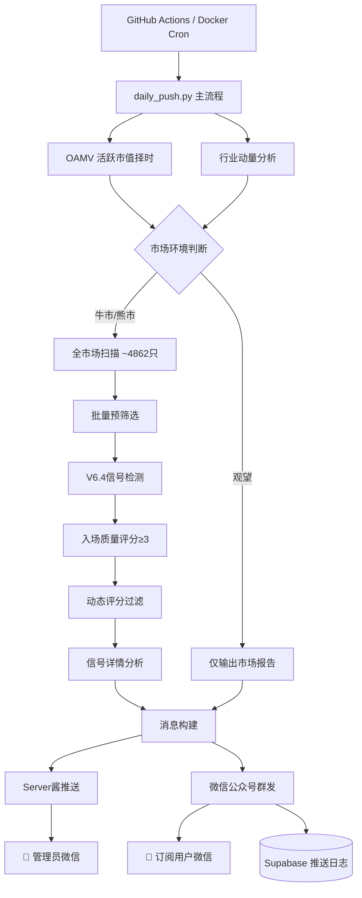
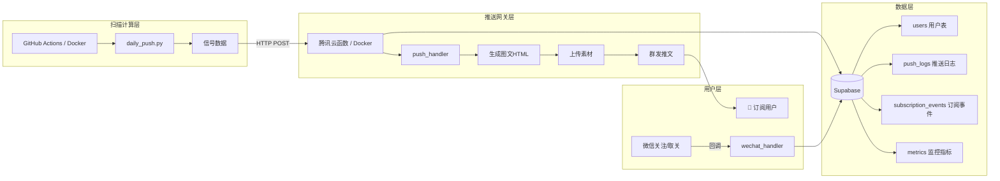

# TradingAgents Code Wiki

> **量化潜伏系统** — A股量化潜伏信号自动筛选与推送系统
> 基于 威科夫量价理论 + VPA量价分析，当前策略版本 **V6.4**
> 项目版本：`6.4.0` · Python `3.10+` · License `MIT`

---

## 目录

- [1. 项目概览](#1-项目概览)
- [2. 整体架构](#2-整体架构)
- [3. 目录结构](#3-目录结构)
- [4. 模块详解](#4-模块详解)
  - [4.1 classic_ta — 核心策略模块](#41-classic_ta--核心策略模块)
  - [4.2 classic_ta.common — 公共子模块](#42-classic_tacommon--公共子模块)
  - [4.3 ml_strategy — OAMV择时模块](#43-ml_strategy--oamv择时模块)
  - [4.4 wechat_push — 微信推送与订阅](#44-wechat_push--微信推送与订阅)
- [5. 关键类与函数参考](#5-关键类与函数参考)
- [6. 依赖关系](#6-依赖关系)
- [7. 数据流与运行流程](#7-数据流与运行流程)
- [8. 项目运行方式](#8-项目运行方式)
- [9. 配置与环境变量](#9-配置与环境变量)
- [10. 测试与质量保障](#10-测试与质量保障)
- [11. 部署与运维](#11-部署与运维)
- [12. 策略版本演进](#12-策略版本演进)

---

## 1. 项目概览

### 1.1 项目定位

TradingAgents（量化潜伏系统）是一套面向 **A股全市场** 的自动化量化筛选工具，每日扫描近 5000 只股票，融合 **威科夫量价理论** 与 **VPA量价分析**，通过多维度量化模型识别潜在的潜伏买入信号，并通过 Server酱 + 微信公众号双通道推送到用户。

### 1.2 核心能力

| 能力 | 说明 |
|------|------|
| 4维度入场质量评分 | J值深度 + 量能枯竭 + 盘面形态 + 均线结构（0-8分综合评分） |
| OAMV市场择时 | 基于活跃市值滞后阈值系统，日线+周线双重确认 |
| 行业动量轮动 | 实时追踪100+行业板块相对强度(RS)，仅在强势行业选股 |
| DuckDB列式缓存 | 股票日线数据增量缓存，扫描效率提升10倍 |
| 多通道推送 | Server酱(微信) + 微信公众号群发双通道 |
| 多数据源降级 | akshare → tushare → mootdx 三级降级机制 |
| 订阅服务后端 | Supabase 用户管理 + 订阅墙 + 推送日志 + 运营统计 |

### 1.3 技术栈

| 类别 | 技术 |
|------|------|
| 语言 | Python 3.10+ |
| 数据源 | akshare / tushare / mootdx（三级降级） |
| 数据缓存 | DuckDB（列式存储） |
| 数据处理 | Pandas / NumPy |
| 技术指标 | 自研（KDJ、ATR、VWAP、量价分析） |
| 自动化部署 | GitHub Actions / Docker / docker-compose |
| 消息推送 | Server酱 + 微信公众号 |
| 用户管理 | Supabase（PostgreSQL + RLS） |
| 推送网关 | 腾讯云函数 / Docker HTTP 服务 |
| 代码质量 | Ruff / pytest / CodeQL / mypy |

---

## 2. 整体架构

### 2.1 系统架构图



### 2.2 订阅服务架构



### 2.3 分层架构

系统采用清晰的分层架构：

```
┌─────────────────────────────────────────────────────────┐
│  运维层  │  GitHub Actions / Docker / trigger_push.py    │
├─────────────────────────────────────────────────────────┤
│  入口层  │  daily_push.py (统一推送入口)                  │
├─────────────────────────────────────────────────────────┤
│  推送层  │  wechat_push (微信) + push_channels (Server酱) │
├─────────────────────────────────────────────────────────┤
│  订阅层  │  subscription.py (订阅墙) + monitoring.py      │
├─────────────────────────────────────────────────────────┤
│  过滤层  │  scanner + oamv_filter (择时) + 行业过滤        │
├─────────────────────────────────────────────────────────┤
│  信号层  │  v60~v64_ambush_model (策略模型)               │
├─────────────────────────────────────────────────────────┤
│  指标层  │  IndicatorCalcBase (白线/黄线/ATR/KDJ)         │
├─────────────────────────────────────────────────────────┤
│  数据层  │  stock_data_duckdb (DuckDB缓存)                │
├─────────────────────────────────────────────────────────┤
│  数据源  │  akshare / tushare / mootdx (三级降级)         │
└─────────────────────────────────────────────────────────┘
```

---

## 3. 目录结构

```
TradingAgents/
├── .github/
│   ├── workflows/
│   │   ├── daily_push.yml      # CI/CD: 每日定时推送（错峰+备用+重试+告警）
│   │   ├── tests.yml           # CI: 单元测试（多版本Python）
│   │   ├── codeql.yml          # CI: 代码安全扫描
│   │   └── keepalive.yml       # 防止60天不活动自动禁用
│   ├── dependabot.yml          # 依赖自动更新
│   └── ISSUE_TEMPLATE/         # Issue 模板
├── classic_ta/                 # 核心策略模块
│   ├── __init__.py
│   ├── daily_push.py           # 统一推送入口（主流程）
│   ├── v60_ambush_model.py     # V6.0基础框架
│   ├── v61_ambush_model.py     # V6.1风险控制
│   ├── v62_ambush_model.py     # V6.2行业动量
│   ├── v63_ambush_model.py     # V6.3微观确认
│   ├── v64_ambush_model.py     # V6.4入场质量评分（当前）
│   ├── v63_mootdx_push.py      # V6.2盘前扫描推送（旧版）
│   ├── stock_data_cache.py     # CSV缓存（旧版）
│   ├── stock_data_duckdb.py    # DuckDB数据缓存引擎（新版）
│   └── common/                 # 公共模块
│       ├── __init__.py
│       ├── scanner.py          # 同步/异步扫描器
│       ├── stock_pool.py       # 股票池+预筛选
│       ├── signal_analyzer.py  # 信号详情分析
│       ├── oamv_status.py      # OAMV择时状态
│       ├── industry_analysis.py# 行业分析
│       ├── push_channels.py    # 推送通道(Server酱)
│       ├── message_builder.py  # 消息构建
│       └── order_execution.py  # 限价单成交判定
├── ml_strategy/                # 机器学习策略
│   ├── __init__.py
│   ├── oamv_filter.py          # OAMV滞后阈值择时
│   └── market_amv_cache.py     # 全市场活跃市值缓存
├── wechat_push/                # 微信公众号推送 + 订阅服务
│   ├── __init__.py             # 群发核心
│   ├── cloud_function.py       # 腾讯云函数入口（4个handler）
│   ├── subscription.py         # 订阅墙中间件 + 计划管理
│   └── monitoring.py           # 推送日志 + 监控埋点 + 运营报表
├── tests/                      # 单元测试（70+ tests）
│   ├── test_indicator_calc.py
│   ├── test_scanner.py
│   ├── test_signal_detection.py
│   └── test_stock_data_duckdb.py
├── docs/
│   ├── deploy.md               # 部署指南
│   ├── schema.sql              # Supabase 数据库 Schema
│   └── specs/                  # 设计文档
├── Dockerfile                  # 容器化构建
├── docker-compose.yml          # 全栈编排
├── pyproject.toml              # 项目元数据 + 工具配置
├── trigger_push.py             # 手动触发推送
├── requirements.txt
├── .env.example                # 环境变量模板
├── CODE_WIKI.md                # 本文档
├── CHANGELOG.md                # 变更日志
├── CONTRIBUTING.md             # 贡献指南
└── README.md
```

---

## 4. 模块详解

### 4.1 classic_ta — 核心策略模块

#### 4.1.1 `daily_push.py` — 统一推送入口

**职责**：V6.4 每日实盘推送的统一入口，整合所有子模块完成"扫描→过滤→推送"全流程。

**主流程（10步）**：

1. **交易日检查** — tushare/akshare交易日历 → 降级为周一~周五
2. **数据预热** — DuckDB缓存状态 + 数据源连通性检查
3. **模式判断** — 09:00-15:00 为盘中模式，否则为盘后模式
4. **OAMV择时** — 调用 `common.oamv_status.get_oamv_status()`
5. **行业分类获取** — tushare `stock_basic`
6. **盘中实时行情** — akshare `stock_zh_a_spot_em`
7. **全市场扫描** — `SyncScanner`（10线程，15min超时）
8. **行业热度分析 + 行业过滤** — `industry_analysis.compute_industry_analysis()`
9. **精细动态评分过滤** — `scanner.apply_dynamic_score_filter()`
10. **消息构建 + 推送** — `message_builder.build_push_message()` → Server酱定时投递 → 盘后公众号群发

**关键配置 `DYNAMIC_SCORE_PARAMS`**：

```python
DYNAMIC_SCORE_PARAMS = {
    "bull_min_score": 4,               # 牛市允许4分信号
    "bull_score4_j_max": 8,            # 4分信号J值上限
    "bull_score4_vol_ratio_max": 0.70, # 4分信号量比上限
    "bear_min_score": 5,               # 熊市允许5分信号
    "j_hard_cap": 8,                   # J值硬上限（一律过滤）
}
```

**命令行用法**：

```bash
python classic_ta/daily_push.py             # 正式推送
python classic_ta/daily_push.py --dry-run   # 仅扫描不推送
```

**导出接口**：

- `daily_push(max_stocks=None)` — 主入口函数，被 `trigger_push.py` 调用

---

#### 4.1.2 `stock_data_duckdb.py` — DuckDB数据缓存引擎

**职责**：将4862个CSV碎文件合并为单个DuckDB文件，提供列式存储 + 增量缓存 + 线程安全 + 除权校验。

**核心API**：

| 函数 | 签名 | 说明 |
|------|------|------|
| `load_stock_cache` | `(ts_code) -> DataFrame or None` | 加载单只股票缓存 |
| `save_stock_cache` | `(ts_code, df)` | 保存数据（保存前自动清洗） |
| `delete_stock_cache` | `(ts_code)` | 删除缓存（除权重建用） |
| `get_stock_data_cached` | `(ts_code, min_rows=130) -> DataFrame or None` | **核心入口**：带增量缓存的数据获取 |
| `get_stock_data_readonly` | `(ts_code, min_rows=130) -> DataFrame or None` | 纯只读获取（多线程扫描用） |
| `batch_update_stocks` | `(ts_codes) -> dict` | 批量补全缓存缺失 |
| `get_cache_stats` | `() -> dict` | 缓存统计（mode, count, dir, size_mb） |
| `migrate_csv_to_duckdb` | `() -> dict` | 一键CSV→DuckDB迁移 |
| `close_thread_local_conns` | `()` | 关闭线程本地连接（多线程扫描结束用） |

**DuckDB表结构**：

```sql
daily_data (ts_code, date, open, high, low, close, volume)
```

**增量缓存流程**：

1. 加载本地缓存（DuckDB优先，CSV回退）
2. 缓存最后日期 ≥ 今天且历史完整 → 直接返回（零API调用）
3. 否则获取增量（**重叠一天用于除权校验**）
4. **除权校验**：overlap日 Close 偏差 > 1% → 全量重建
5. 正常增量合并并保存

**线程安全机制**：

- `_duckdb_write_lock` (threading.Lock) 防并发写冲突
- 线程本地只读连接池 (`_get_thread_local_read_conn`) 避免重复创建连接
- `_pending_write_queue` + `batch_update_stocks` 批量写入模式

**数据清洗规则**（`_clean_dataframe`）：

- 排除 Volume=0 的停牌日
- 排除 OHLC 为 NaN 或 0 的行
- 前复权突变检测（单日涨跌幅 > 50% 视为异常）
- 列名大小写标准化（如 `open` → `Open`）
- 大量异常（>3行）时保留数据仅记录警告

---

#### 4.1.3 `stock_data_cache.py` — CSV增量缓存（旧版）

**职责**：股票日线OHLCV数据的本地CSV增量缓存，每只股票一个CSV文件。已被 DuckDB 引擎取代，保留兼容。

**关键常量**：

- `CACHE_DIR = Path(__file__).parent.parent / "results" / "stock_cache"`
- `DEFAULT_START_DATE = "20240101"`

**核心函数**：

| 函数 | 说明 |
|------|------|
| `get_stock_data_cached(ts_code, min_rows=130)` | 带增量缓存的数据获取（核心入口） |
| `load_stock_cache(ts_code)` | 加载单只股票缓存 |
| `save_stock_cache(ts_code, df)` | 保存到CSV |
| `get_cache_stats()` | 缓存统计 |

**数据源策略**（`_fetch_raw_stock_data`）：

- **优先 akshare**（无限流）：`ak.stock_zh_a_hist(adjust="qfq")`
- **降级 tushare**：`pro.daily()` + `pro.adj_factor()` 手动前复权

---

#### 4.1.4 策略模型版本族

##### V6.0 `v60_ambush_model.py` — 基础潜伏模型

**核心理念**：看到SOS信号后不追涨，等情绪冰点后潜伏等待拉升。

**策略流程**：

1. **SOS锚定** — 识别需求大阳线（SOS），确认主力已入场
2. **情绪冰点** — SOS后1~5天内，等待J值跌入超卖区 + 缩量 + 小实体
3. **潜伏买入** — 在冰点日T日确认，T+1开盘执行（含ATR化防护）
4. **持仓退出** — 7级退出机制

**核心函数**：

| 函数 | 说明 |
|------|------|
| `IndicatorCalcBase(df)` | 指标计算工厂（白线/黄线/ATR14/KDJ/成交量均线） |
| `Detect_AmbushSignal(df, params)` | 两阶段信号引擎：SOS锚定 → 情绪冰点潜伏 |
| `StatefulTradeBacktester(df, signal_col, initial_cash, params, market_allow_buy)` | 7级退出状态机回测 |
| `run_v60_backtest(df, params, market_allow_buy)` | 一键回测入口 |
| `compute_metrics(trades)` | 回测指标计算 |

**指标计算**（`IndicatorCalcBase`）：

- **白线**：`Close.ewm(span=10).ewm(span=10)` 双重EMA
- **黄线**：`(ma14 + ma28 + ma57 + ma114) / 4` 四均线均值
- **ATR14**：True Range的14日简单移动平均
- **KDJ**：9日RSV → K(com=2 EMA) → D(com=2 EMA) → `J = 3K - 2D`（clip 0~100）

**关键数据类**：

- `Position` — 持仓信息（entry_date, entry_idx, entry_price, shares, atr_at_entry, yellow_at_entry, hold_days, max_profit_pct）
- `TradeRecord` — 交易记录
- `ExitReason(Enum)` — 7种退出原因：ATR_HARD_STOP, TRAILING_TAKE, BREAKEVEN_STOP, BUY_CLIMAX, TIME_STOP, DEATH_CROSS, MAX_HOLD

**`DEFAULT_PARAMS` 关键参数**：

```python
DEFAULT_PARAMS = {
    # SOS锚定
    "sos_body_ratio": 0.50,         # SOS实体占比≥50%
    "sos_vol_absolute": 0.75,       # SOS量比绝对值
    "sos_vol_relative": 1.5,        # SOS量比相对值
    "support_atr_mult": 1.5,        # 支撑ATR倍数
    # 潜伏冰点
    "ambush_window": 5,             # SOS后潜伏窗口
    "ambush_j_oversold": 13,        # J值超卖阈值
    "ambush_vol_shrink": 0.70,      # 量能萎缩阈值
    "ambush_body_pct": 0.03,        # 实体占比阈值
    # 退出
    "hard_stop_atr": 2.0,           # 硬止损ATR倍数
    "trailing_trigger": 0.15,       # 追踪止盈触发
    "time_stop_days": 8,            # 时间止损天数
    "max_hold_days": 20,            # 最大持仓天数
    # T+1防护
    "t1_high_open_atr": 1.5,        # 高开防护ATR倍数
}
```

**防未来数据泄漏**：SOS锚定使用 `shift(1).rolling()` 确保只看T日及之前；潜伏信号在冰点日T日确认，T+1开盘执行。

---

##### V6.1 `v61_ambush_model.py` — Spring Test + 吊灯止盈

**核心改进**：

**P0-1：Spring Test 弹簧试探**（`Detect_AmbushSignal_V61`）：

在V6.0冰点条件基础上追加（三选一OR逻辑）：

- a) 下影线 > 实体长度（探底回升）
- b) 收盘价 > 开盘价（收阳）
- c) J值拐头（当日J > 前日J）

**P0-2：4级退出 + 吊灯止盈**（`StatefulTradeBacktester_V61`）：

- 优先级1：硬止损（2.5ATR）
- 优先级2：吊灯止盈（Chandelier Exit）— `追踪止盈线 = 买入后最高价 - (atr_mult × 潜伏日ATR)`，只上移不下移
- 优先级3：Buy Climax精细化（三条件：努力无结果 + 派发特征 + 位置确认）
- 优先级4：时间止损（合并原时间止损+超时平仓+死叉）

**`V61_PARAMS` 关键差异**：

```python
V61_PARAMS = {
    "ambush_j_oversold": 18,
    "ambush_vol_shrink": 0.8,
    "ambush_body_pct": 0.04,
    "ambush_window": 7,
    "hard_stop_atr": 2.5,
    "time_stop_days": 10,
    "spring_test_enabled": True,
    "spring_body_ratio": 1.0,
    "chandelier_atr_mult": 3.0,
    "chandelier_min_days": 2,
    "climax_body_pct": 0.02,
    "climax_shadow_ratio": 2.0,
}
```

**`Position` 类扩展**：新增 `highest_high`、`chandelier_line`、`ts_code` 字段；新增 `update_chandelier(high_price, atr_mult)` 方法。

**`ExitReason` 枚举扩展**：新增 `CHANDELIER_EXIT`、`VPA_DISTRIBUTION`、`EARLY_EXIT`。

---

##### V6.2 `v62_ambush_model.py` — 行业动量过滤

**核心新增函数**：

| 函数 | 说明 |
|------|------|
| `compute_industry_momentum(signals_cache, industry_map, momentum_days)` | 计算每个行业每天的动量值（近N日等权平均涨幅） |
| `build_industry_allow_matrix(mom_df, threshold)` | 根据行业动量构建允许买入矩阵（mom > threshold） |
| `StatefulTradeBacktester_V62(...)` | V6.2状态机回测（追加行业过滤参数） |

**行业动量计算逻辑**：

1. 收集每个行业所有股票的日收益率
2. 至少3只股票才算行业
3. 等权平均日收益率
4. 近N日累计涨幅（rolling sum）

**`V62_PARAMS` 关键差异**：

```python
V62_PARAMS = {
    "spring_test_enabled": False,           # 关闭弹簧试探
    "chandelier_atr_mult": 2.5,
    "hard_stop_atr": 2.5,
    "time_stop_days": 8,
    "ambush_j_oversold": 18,
    "ambush_window": 12,
    "industry_filter_enabled": True,
    "industry_momentum_days": 20,
    "industry_momentum_threshold": 0.0,
}
```

---

##### V6.3 `v63_ambush_model.py` — 四维度深度优化

**四维度优化**：

| 维度 | 改进 | 说明 |
|------|------|------|
| 横截面RS | 绝对阈值→百分位排名Top 20% | 自适应牛熊的行业过滤 |
| 波动率平价 | 固定仓位→`shares=(资金×1%)/(ATR×止损倍数)` | 风险标准化 |
| 微观确认 | Spring Test→VWAP/VCP右侧微确认 | 更精准的止跌信号 |
| 限价单 | 市价→`限价=Close×(1-折扣)` | 控制滑点 |

**核心API**：

| 函数 | 说明 |
|------|------|
| `add_micro_confirm_indicators(df, params)` | VWAP/VCP微观确认指标 |
| `Detect_AmbushSignal_V63(df, params)` | V6.3信号检测 |
| `StatefulTradeBacktester_V63(...)` | V6.3状态机回测器 |
| `calc_volatility_parity_shares(total_equity, entry_price, atr_at_entry, hard_stop_atr, params)` | 波动率平价仓位 |
| `calc_dynamic_stop_params(df, idx, params)` | ATR百分位动态止损 |
| `calc_limit_price(close, yellow, atr, params)` | 限价单价格计算 |
| `compute_industry_rs_matrix(signals_cache, industry_map, ...)` | 横截面相对强度矩阵 |
| `build_industry_allow_matrix_v63(...)` | V6.3行业允许矩阵 |

**关键数据类**：

- `PositionV63` — 扩展持仓信息（含 support_score, limit_price, dynamic_hard_stop_atr, consecutive_bearish_vpa 等）
- `V63_PARAMS` — V6.3参数集

---

##### V6.4 `v64_ambush_model.py` — 入场质量评分（当前最新版）

**核心创新：入场质量评分（0~8分）**

`add_entry_quality_indicators(df, params)` 计算4个维度的综合评分：

| 维度 | 评分字段 | 评分逻辑 | 含义 |
|------|---------|---------|------|
| **E1: J值深度** | `eq_j_score` (0~2) | J<0 → 2分; J<5 → 1分; J<13 → 0分 | 情绪冰点程度 |
| **E2: 量能枯竭** | `eq_vol_score` (0~2) | 量<30%均量 → 2分; <50% → 1分; <70% → 0分 | 成交量萎缩程度 |
| **E3: 盘面形态** | `eq_candle_score` (0~2) | 长下影线 + 小实体 + 收阳 三项叠加（clip 2） | 蜡烛图质量 |
| **E4: 黄白线关系** | `eq_ma_score` (0~2) | 金叉(回看3日) → 1分; 收敛(ATR容差0.5) → 1分; 白线>黄线 → 2分 | 均线结构 |

**E5: 趋势方向二级过滤**（V6.4.9）：

- `eq_trend_rising = yellow_line > yellow_line.shift(5)` — 黄线5日前 vs 现在
- 当 `entry_quality_score >= eq_trend_dir_min_score(3)` 时，要求黄线上升

**V6.4.9 评分=3子模式过滤**：

- 排除 `V=1 且 J=0` 的弱组合（J0V1C0M2胜率42%，远低于其他score=3）

**主力托底评分（旧体系，默认关闭）**

`add_inst_support_indicators(df, params)` 计算0~4分，包含4个因子：

| 因子 | 逻辑 | 含义 |
|------|------|------|
| **A: 缩量企稳持续性** | 连续2~3天缩量 且 价格未创新低 | 抛压已真正枯竭 |
| **B: 量价底背离** | 近N日价格创新低 但 OBV不创新低 | 资金在低位悄悄吃货 |
| **C: 支撑反复试探不破** | 近N日价格多次(2+次)触碰黄线但都收回 | 主力在关键位护盘 |
| **D: 日内承接信号** | 近3日内出现 长下影线/收在日高附近/缩量小阳 | 盘中有人主动买入 |

**OBV指标**（`calc_obv`）：`direction = sign(Close.diff())`, `OBV = (direction × Volume).cumsum()`

**信号检测**（`Detect_AmbushSignal_V64`）：

```python
ambush_signal = V6.3信号 & (entry_quality_score >= min_score) & 趋势过滤 & 子模式过滤
```

**状态机回测**（`StatefulTradeBacktester_V64`）继承V6.3全部退出逻辑，新增：

1. **V6.4.6 差异化仓位**：

```python
score_position_mult = {0:0.7, 1:0.7, 2:0.7, 3:1.0, 4:1.0, 5:1.2, 6:1.3, 7:1.5, 8:1.5}
```

2. **V6.4.6 差异化持仓时间**：

```python
score_time_stop_days = {0:5, 1:5, 2:5, 3:7, 4:7, 5:8, 6:9, 7:10, 8:10}
```

3. **V6.4.7 保本止损**：
   - 浮盈达到3%时激活保本
   - 回调到成本价+0.5%即止盈离场

4. **退出优先级**（完整继承V6.3 + 新增）：
   - 优先级0.5：保本止损（V6.4.7新增）
   - 优先级1：硬止损（动态ATR）
   - 优先级2：吊灯止盈（UT/AD收紧）
   - 优先级3：Buy Climax精细化
   - 优先级3.5：VPA派发信号
   - 优先级3.8：快速验证退出（V6.4.5默认禁用）
   - 优先级4：动态时间止损

**`V64_PARAMS` 关键参数**：

```python
V64_PARAMS = V63_PARAMS.copy()
V64_PARAMS.update({
    "entry_quality_enabled": True,
    "entry_quality_min_score": 3,            # 最低入场质量分
    "eq_trend_dir_enabled": True,            # V6.4.9 趋势方向过滤
    "eq_sub_filter_exclude_v1_j0": True,     # V6.4.9 排除弱组合
    "inst_support_enabled": False,           # 关闭旧B+C+D评分
    "early_exit_enabled": False,             # V6.4.5 禁用快速退出
    "time_stop_days": 7,                     # V6.4.5 缩短时间止损
    "score_position_enabled": True,          # V6.4.8 差异化仓位
    "score_time_stop_enabled": True,         # V6.4.8 差异化持仓时间
    "breakeven_stop_enabled": True,          # V6.4.7 保本止损
    "breakeven_trigger_pct": 0.03,           # 浮盈3%激活保本
    "breakeven_min_profit_pct": 0.005,       # 保本保留0.5%利润
})
```

**辅助分析函数**：

- `PositionV64(PositionV63)` — 扩展持仓，新增 `inst_support_score` 和 `factor_details`（如 "J2V1C2M1" 格式）
- `analyze_support_score_impact(trades)` — 按评分分组分析交易表现
- `_count_patterns(trades)` — 统计各因子组合模式出现次数（Top 5）
- `run_v64_backtest(df, params, market_allow_buy, ts_code, industry_allow_buy)` — 便捷回测入口

---

#### 4.1.5 `v63_mootdx_push.py` — V6.2盘前扫描推送（旧版）

**职责**：基于V6.2最佳参数 + 行业动量过滤 + OAMV择时的盘前扫描推送脚本，使用akshare数据源 + 并发获取 + 批量预筛选。是 `daily_push.py` 的前身版本。

**核心函数**：

| 函数 | 说明 |
|------|------|
| `mootdx_bestip()` | 动态寻找延迟最低的通达信行情节点 |
| `get_all_a_stocks()` | 获取全市场A股列表（akshare优先，tushare降级） |
| `batch_prefilter_stocks()` | 批量预筛选（排除ST/退市/停牌/北交所 + 强势行业过滤） |
| `get_oamv_status()` | OAMV活跃市值择时状态 |
| `compute_industry_analysis(signals_data, industry_map)` | 行业热度分析 |
| `analyze_signal_detail(df, signal_idx)` | 信号详细分析（威科夫/VPA/蜡烛图三维度解读） |
| `scan_market(max_stocks, ...)` | 全市场扫描（10线程并发 + 断点续传） |
| `build_push_message(oamv_status, signals, industry_stats)` | 构建Markdown推送消息 |
| `daily_push(max_stocks)` | 主入口 |

**关键特性**：

1. **断点续传** — `scan_status.json` 记录已完成股票，扫描中断后可恢复
2. **批量预筛选** — 行业板块涨跌幅前50% + 排除ST/退市/停牌/北交所
3. **OAMV择时** — SMA(15)平滑 + CostMA(42), 阈值+2.0%/-1.0%
4. **行业热度分析** — 6级冷热分类 + 7级轮动信号
5. **信号详细分析** — 威科夫解读 + VPA量价 + 蜡烛图三维度

---

### 4.2 classic_ta.common — 公共子模块

#### 4.2.1 `scanner.py` — 全市场扫描引擎

**职责**：提供同步（`SyncScanner`）和异步（`AsyncScanner`）两种全市场扫描模式，支持akshare批量预筛选、断点续传、盘中实时K线拼接、行业过滤+入场质量评分过滤。

**核心函数与类**：

##### 信号处理核心逻辑

| 函数 | 说明 |
|------|------|
| `_fetch_and_process_one_core(ts_code, name, industry, best_params, realtime_quote=None)` | 获取单只股票数据并计算指标的核心逻辑 |
| `_fetch_and_process_one_with_retry(...)` | 带重试的股票处理（tenacity 3次重试，指数退避2-10秒） |
| `_fetch_and_process_one(...)` | 异常包装层，捕获所有异常并返回None |
| `_extract_signal_info(ts_code, name, industry, df, best_params)` | 从已处理DataFrame提取信号信息 |

**`_fetch_and_process_one_core` 处理流程**：

1. 调用 `get_stock_data_readonly` 获取数据（min_rows=130）
2. 盘中模式拼接实时K线
3. 依次调用 `IndicatorCalcBase` → `add_micro_confirm_indicators` → `add_inst_support_indicators` → `Detect_AmbushSignal_V64`
4. 返回 `(ts_code, name, industry, df_or_None)`

##### SyncScanner 类

基于 `ThreadPoolExecutor` 的同步扫描器。

```python
SyncScanner(best_params, result_dir=None, max_workers=10, scan_timeout_sec=900)
```

- `scan_timeout_sec`: 全局扫描超时（默认15分钟，防止GitHub Actions超时）

**核心方法**：

| 方法 | 说明 |
|------|------|
| `_load_scan_status()` / `_save_scan_status(completed_set)` / `_clear_scan_status()` | 断点续传机制 |
| `_flush_pending_writes()` | 扫描结束后批量补全缓存缺失的股票数据 |
| `scan(industry_allow_matrix, industry_map, prefilter_df, realtime_quotes, oamv_weekly_allowed_dates)` | 主扫描方法，返回 `(signals, all_signals_data)` |

**scan 方法流程**：

1. 获取股票列表 → 预筛选过滤
2. 断点续传跳过已完成
3. ThreadPoolExecutor并发处理
4. 进度输出（每100只）
5. 超时检查
6. 行业过滤 → OAMV日期过滤 → 信号收集
7. 清理DuckDB连接池、断点续传状态、补全缓存

##### AsyncScanner 类

基于 `asyncio` 的异步扫描器，优势：异步I/O、智能预筛选、分批处理、实时进度。

```python
AsyncScanner(best_params, result_dir=None, max_concurrent=20, batch_size=500)
```

##### `apply_dynamic_score_filter`

```python
apply_dynamic_score_filter(signals, oamv_status, dynamic_score_params)
```

**精细动态评分过滤**：

- J值硬上限过滤
- 牛市：评分≥5通过，或评分4且J值/量比达标
- 熊市：评分≥6才通过

---

#### 4.2.2 `stock_pool.py` — 股票池获取与预筛选

**职责**：获取全市场A股列表和批量预筛选，支持akshare（优先，无限流）和tushare（降级）两种数据源。

**核心函数**：

| 函数 | 说明 |
|------|------|
| `get_all_a_stocks()` | 获取全市场A股列表，返回 `[(ts_code, name, industry), ...]` |
| `batch_prefilter_stocks()` | 用akshare批量获取全市场实时行情快速预筛选 |
| `get_realtime_quotes()` | 获取全市场实时行情 |
| `append_realtime_bar(df, realtime_quote, today_str=None)` | 将akshare实时行情拼接到日线数据末尾 |

**`get_all_a_stocks` 过滤规则**：

- 排除ST、*ST、N开头股票
- 仅保留沪市（6开头.SH）和深市（0/3开头.SZ）
- tushare降级时额外过滤上市日期<20250101

**`batch_prefilter_stocks` 过滤规则**：

- 排除ST、北交所（8/9开头）、停牌、退市、低价股（<3元）

---

#### 4.2.3 `signal_analyzer.py` — 信号详情分析

**职责**：对信号日进行多维度解读，包括威科夫（Wyckoff）、VPA量价、蜡烛图、支撑阻力分析。

**核心函数**：

```python
analyze_signal_detail(df, signal_idx, best_params) -> dict
```

**返回结构**：

```python
{
    "wyckoff": [...],      # 威科夫解读（SOS需求确认/No Supply/Test/LPS/情绪冰点）
    "vpa": [...],          # VPA量价解读（缩量比例/小实体/下影线支撑）
    "candle": [...],       # 蜡烛图解读（十字星/阳线收高/锤子线）
    "support": float,      # 支撑位 = yellow_line - 0.5 * atr14
    "resistance": float,   # 阻力位 = yellow_line + 1.5 * atr14
}
```

**关键逻辑**：

- 威科夫解读检查 `tag_sos_anchor`、`tag_no_supply`、`tag_test` 标志
- VPA量价解读使用 `ambush_vol_shrink`、`ambush_body_pct` 参数
- 支撑阻力基于 `yellow_line` 和 `atr14` 计算

---

#### 4.2.4 `oamv_status.py` — OAMV择时状态

**职责**：获取OAMV（活跃市值）择时状态，支持两种数据源：全市场活跃市值（优先）和沪深300成交额代理（降级）。

**核心函数**：

| 函数 | 说明 |
|------|------|
| `get_oamv_status()` | 获取OAMV活跃市值当前状态 |
| `_oamv_from_index()` | 用沪深300成交额代理OAMV的降级方案 |

**`get_oamv_status` 返回结构**：

```python
{
    "latest_date": str,
    "daily_allowed": bool,
    "weekly_allowed": bool,
    "can_open_position": bool,    # daily AND weekly
    "latest_x": float,
    "data_source": str,
    "recent_states": [...],       # 最近5日
    "last_transition": ...,
    "trend_label": str,
}
```

**OAMV参数（优化后）**：

```python
OAMVHysteresisFilter(
    upper_threshold=2.0,
    lower_threshold=-1.0,
    cost_ma_period=42,
    roc_period=1,
    weekly_ema_period=5,
    weekly_use_ema=True,
    smooth_method='sma',
    smooth_period=15,
    cost_ma_method='sma'
)
```

---

#### 4.2.5 `industry_analysis.py` — 行业分析

**职责**：计算行业动量、冷热分布、轮动信号、行业滞涨股识别等。

**核心函数**：

| 函数 | 说明 |
|------|------|
| `compute_industry_analysis(signals_data, industry_map, best_params)` | 计算行业间分析：动量、信号数量、热度排名、轮动信号 |
| `compute_industry_ma_lines(all_signals_data, industry_map)` | 计算行业级别黄白线（平均各成分股的white_line/yellow_line） |
| `compute_industry_lag_signals(signals, mom_df, best_params, industry_ma=None)` | 为每个信号计算个股动量，标记动量达标信号 |

**热度分类**：

- 火热(>0.05) / 偏热(>0.02) / 微热(>0) / 微冷(>-0.02) / 偏冷(>-0.05) / 冰冷

**轮动信号**：

- 轮入 / 轮出 / 加速 / 减速 / 回暖 / 恶化 / 平稳

**滞涨股识别参数**：

- `lag_filter_enabled`: 是否启用滞涨股过滤
- `lag_stock_max_return`: 个股动量达标阈值（默认-0.03）
- `lag_score_boost`: 动量达标评分加分（默认+1，上限8分）

---

#### 4.2.6 `push_channels.py` — Server酱推送通道

**职责**：Server酱微信推送的高可用实现，支持3次重试（指数退避）、定时投递降级、pushid记录、内容长度预检、分组推送。

**重要常量**：

```python
SERVERCHAN_KEYS_ADMIN     # 管理员组Key列表（环境变量 SERVERCHAN_KEY）
SERVERCHAN_KEYS_BETA      # 内测组Key列表（环境变量 SERVERCHAN_KEY_BETA）
_MAX_CONTENT_LENGTH = 60000   # 内容长度限制
_MAX_RETRIES = 3              # 最大重试次数
_RETRY_BACKOFF_BASE = 3       # 退避基数（秒）
_REQUEST_TIMEOUT = 30         # 单次请求超时
_DEGRADATION_RETRIES = 2      # 降级重试次数
```

**核心函数**：

| 函数 | 说明 |
|------|------|
| `_get_session()` | 获取/创建requests Session（连接池复用） |
| `_truncate_content(desp)` | 内容长度预检，超长截断 |
| `_do_send(key, title, desp, scheduled=None)` | 执行单次Server酱推送请求 |
| `_send_with_retry(key, title, desp, scheduled=None, max_retries=_MAX_RETRIES)` | 带指数退避的重试发送（3s → 6s → 12s） |
| `send_serverchan(title, desp, keys=None, scheduled=None)` | 主推送接口，支持分组推送和定时发送 |
| `get_last_push_ids()` | 获取最近一次推送的pushid列表 |
| `send_group_push(admin_title, admin_desp, beta_title, beta_desp, scheduled=None)` | 分组推送：管理员组（完整技术版）+ 内测组（精简卡片版） |

**两阶段保障**：定时投递失败 → 降级为立即发送

---

#### 4.2.7 `message_builder.py` — 推送消息构建

**职责**：构建推送消息，支持管理员组（完整技术版Markdown）和内测组（精简卡片版）两种格式。

**重要常量**：

```python
SEASONAL_RULES = {
    "danger_months": [3, 5],        # 危险月份
    "golden_months": [8, 10],       # 黄金月份
    "optimal_hold_days": 10,        # 最优持仓天数
}

PRIORITY_TIER_RULES = {
    "score_8_golden": True,         # 8分黄金信号优先
    "vol_extreme_shrink": 0.3,      # 极度缩量阈值
    "price_sweet_spot": (10, 20),   # 价格最佳区间
    "score_7_downgrade": True,      # 7分降级为普通挡
}
```

**核心函数**：

| 函数 | 说明 |
|------|------|
| `build_push_message(oamv_status, signals, industry_stats, best_params, is_intraday=False)` | 构建管理员组推送消息（完整技术版，Markdown格式） |
| `build_beta_push_message(...)` | 构建内测组推送消息（精简卡片式） |
| `_classify_signals(signals)` | 信号分级：优先考虑挡 vs 普通挡 |
| `_append_signal_detail(lines, s, index, icon, is_priority=True)` | 追加单个信号的详细信息 |

**消息结构**（管理员版）：

1. 今日概览
2. 市场环境（OAMV+季节性）
3. 行业风向
4. 潜伏信号（分级）
5. 策略说明
6. 免责声明

**信号详情包含**：

- 优先挡标签
- 评分星级（★★★/★★☆/★☆☆）
- 评分拆解（E1情绪/E2量能/E3形态/E4均线）
- 价格涨跌、均线结构
- 核心指标（J值/量比）
- SOS锚定、威科夫解读
- 个股动量、VPA量价、蜡烛图
- 支撑阻力
- 交易参考（买入价/硬止损/吊灯线/风险收益比/仓位建议）

---

#### 4.2.8 `order_execution.py` — 限价单成交判定

**职责**：提供生产级别的限价单成交判定逻辑，考虑滑点、安全垫和流动性。

**重要常量**：

```python
DEFAULT_EXECUTION_PARAMS = {
    "slippage_pct": 0.001,           # 0.1%滑点
    "tick_buffer": 0.01,             # 1分钱安全垫
    "volume_depth_check": True,      # 启用成交量深度检查
    "min_volume_ratio": 0.5,         # 最低成交量比
}
```

**核心函数**：

| 函数 | 说明 |
|------|------|
| `check_limit_order_fill(limit_price, next_bar_ohlcv, params=None)` | 判定T+1日限价单是否成交，返回 `(filled, fill_price, fill_reason)` |
| `calc_fill_price_with_slippage(base_price, slippage_pct=0.001, direction="buy")` | 计算含滑点的成交价 |

**成交原因**：

- `gap_down_fill`: 开盘跳空低开成交
- `intraday_fill`: 盘中触及限价成交
- `not_filled_no_penetration`: 未穿透安全垫
- `not_filled_low_volume`: 成交量不足
- `not_filled_gap_up`: 全天高于限价
- `invalid_data`: 数据无效

**关键设计**：

- 兼容dict和pd.Series两种K线数据格式
- 安全垫机制避免回测中的"虚假成交"
- 成交量深度检查模拟真实流动性约束

---

### 4.3 ml_strategy — OAMV择时模块

#### 4.3.1 `oamv_filter.py` — OAMV滞后阈值择时

**职责**：实现 OAMV（活跃市值）择时过滤器的核心算法。通过计算活跃市值与其成本均线的偏离度（x_t），结合滞回（Hysteresis）阈值切换状态，输出"允许交易/不允许交易"的日级和周级择时信号。

**关键类：`OAMVHysteresisFilter`**

```python
OAMVHysteresisFilter(
    upper_threshold=2.0,         # 滞回上阈值(%)
    lower_threshold=-1.0,        # 滞回下阈值(%)
    cost_ma_period=42,           # 成本均线周期
    roc_period=1,
    weekly_ema_period=5,         # 周级EMA周期
    weekly_use_ema=True,
    smooth_method='sma',         # 平滑方式: hybrid/ema/sma/none
    smooth_period=15,            # 平滑周期
    cost_ma_method='sma'         # 成本均线方式: sma/ema
)
```

**核心方法**：

| 方法 | 说明 |
|------|------|
| `compute_oamv_proxy(index_df)` | 用指数 amount 作代理计算 OAMV |
| `compute_oamv_live_chips(daily_basic_df)` | 用 total_mv×turnover_rate_f/100 计算"活跃筹码" |
| `compute_oamv_universe(all_stock_data, daily_basic_cache=None)` | 聚合全市场股票池的活跃市值 |
| `compute_oamv_from_series(amv_series)` | 从预计算的活跃市值序列直接计算 |
| `compute_weekly_oamv(daily_state_df)` | 周级重采样（W-FRI）+ EMA/SMA + 周级滞回状态机 |
| `apply_hysteresis(x_t)` | 日级滞回状态机 |
| `fit(index_df, daily_basic_df, all_stock_data, daily_basic_cache, amv_series)` | 主入口：按优先级选择数据源计算并拟合 |
| `get_state_df()` | 返回包含 oamv_state/oamv_x/oamv_smooth/oamv_cost_ma 的 DataFrame |
| `get_state_dict()` | 返回 {date: state} 字典 |
| `is_trading_allowed(date, require_weekly=True)` | 判断某日是否允许交易（日级 AND 周级） |
| `get_transition_dates()` | 返回状态切换点列表 |
| `summary()` | 返回可读的统计摘要字符串 |

**核心算法**：

1. **x_t 计算**：`x_t = (oamv_smooth - cost_ma) / cost_ma * 100.0`
2. **日级滞回状态机**：
   - `val >= upper_threshold` → state = 1（看多/允许交易）
   - `val <= lower_threshold` → state = 0（看空/不允许交易）
   - 中间区间保持原状态（滞回特性）
3. **周级状态机**：增加"缓冲区突破"逻辑
4. **fit 方法数据源优先级**：`amv_series` > `all_stock_data` > `daily_basic_df` > `index_df`

---

#### 4.3.2 `market_amv_cache.py` — 全市场活跃市值缓存

**职责**：全市场活跃市值（AMV）的缓存与增量获取模块。通过 tushare `daily_basic` 接口逐日聚合全市场活跃市值 `Σ(circ_mv × turnover_rate_f / 100)`，结果缓存到本地 CSV。

**重要常量**：

```python
CACHE_DIR = Path(__file__).parent.parent / "results" / "oamv_cache"
CACHE_FILE = CACHE_DIR / "market_amv_cache.csv"
```

**核心函数**：

| 函数 | 说明 |
|------|------|
| `_get_pro()` | 动态导入 tushare 并返回 `ts.pro_api()` 实例 |
| `load_cache()` | 从 CSV 加载缓存 |
| `save_cache(df)` | 保存缓存到 CSV |
| `fetch_market_amv(start_date, end_date, existing_cache, max_age_days=730)` | 核心：增量获取全市场 AMV |
| `_merge_amv_columns(df)` | 合并 `amv` 和 `amv_circ` 列 |
| `get_market_amv_series()` | 实盘便捷接口：加载缓存+增量更新+返回 Series |
| `get_market_amv_series_for_backtest(start_date="20200101", end_date=None)` | 回测专用：保留全部历史 |

**核心逻辑**（`fetch_market_amv`）：

1. 获取 SSE 交易日历，过滤 `is_open==1`
2. 增量计算：将已有缓存的日期从待获取列表中剔除
3. 逐日调用 `pro.daily_basic(trade_date=td, fields='ts_code,trade_date,circ_mv,turnover_rate_f')`
4. 对每日：`amv = (circ_mv * turnover_rate_f / 100.0).sum()`
5. 合并新旧数据：`pd.concat` + 去重 + 排序
6. 按 `max_age_days` 裁剪历史
7. 保存缓存

**容错与降级**：

- 单日获取失败：`logger.warning` + `time.sleep(1)` 继续下一天
- 全部失败：返回 `existing_cache`（不破坏已有缓存）

---

### 4.4 wechat_push — 微信推送与订阅

#### 4.4.1 `__init__.py` — 群发核心

**对外接口**（通过 import 反推）：

| 名称 | 类型 | 职责 |
|------|------|------|
| `check_signature` | 函数 | 微信公众号签名校验（GET 验证） |
| `handle_wechat_event` | 函数 | 处理微信事件推送（关注/取关/消息），返回 XML 回复 |
| `push_signals_to_wechat` | 函数 | 群发信号到微信公众号，返回结果字典 |
| `get_access_token` | 函数 | 获取微信 access_token |
| `PUSH_API_KEY` | 常量 | 推送 API 鉴权密钥 |

---

#### 4.4.2 `cloud_function.py` — 腾讯云函数入口

**职责**：腾讯云函数（SCF）入口模块，提供 4 个云函数 handler，对应 4 个 HTTP 端点。

**API 路由设计**：

| 端点 | 方法 | Handler | 认证 |
|------|------|---------|------|
| `/wechat` | GET | `wechat_handler` | 无（微信验证签名） |
| `/wechat` | POST | `wechat_handler` | 无（微信事件推送） |
| `/push` | POST | `push_handler` | Bearer PUSH_API_KEY |
| `/health` | GET | `health_handler` | 无 |
| `/stats` | GET | `stats_handler` | Bearer PUSH_API_KEY |

**关键函数**：

| 函数 | 职责 |
|------|------|
| `wechat_handler(event, context)` | 处理微信回调：GET 校验 signature 返回 echostr；POST 解析 body 调用 `handle_wechat_event` |
| `push_handler(event, context)` | 接收 GitHub Actions 推送：验证 Bearer → 过期订阅 → 群发 → 记录日志 + 埋点 |
| `health_handler(event, context)` | 健康检查端点：调用 `health_check()`，healthy→200，否则→503 |
| `stats_handler(event, context)` | 运营统计端点：需 Bearer 认证，支持 `?days=7` 查询参数 |

**push_handler 非致命容错**：

- 过期订阅失败、记录日志失败均被 `try/except` 包裹
- 保证即使监控/订阅子系统故障，推送本身仍能完成

**指标埋点**：

- `push.wechat.success`：1 或 0，tags={"mode": "intraday"/"after_hours"}
- `scan.signal_count`：信号数量

---

#### 4.4.3 `subscription.py` — 订阅墙中间件

**职责**：订阅墙中间件，管理用户订阅状态、计划升级、过期检查、权限校验。数据后端为 Supabase。

**订阅计划配置 `PLAN_CONFIG`**：

| plan | name | duration_days | price | has_signals |
|------|------|---------------|-------|-------------|
| `trial` | 免费试用 | 7 | 0 | True |
| `free` | 免费版 | None | 0 | False |
| `monthly` | 月度订阅 | 30 | 29 | True |
| `quarterly` | 季度订阅 | 90 | 79 | True |
| `yearly` | 年度订阅 | 365 | 199 | True |
| `expired` | 已过期 | 0 | 0 | False |

**核心函数**：

| 函数 | 说明 |
|------|------|
| `get_user_subscription(open_id)` | 查询用户订阅状态 |
| `check_push_permission(open_id)` | 检查用户是否有权限接收信号推送 |
| `start_trial(open_id, nickname="")` | 为新用户开通 7 天试用 |
| `upgrade_plan(open_id, new_plan, amount=0)` | 升级到 monthly/quarterly/yearly |
| `expire_overdue_subscriptions()` | 批量过期：查询 plan_expire < now 的用户，置为 expired |
| `get_subscription_stats()` | 统计概览：total/active/by_plan |
| `_log_event(open_id, event_type, from_plan, to_plan, amount, note)` | 记录订阅事件到审计表 |

**`get_user_subscription` 返回结构**：

```python
{
    "open_id": "...",
    "plan": "trial",
    "plan_name": "免费试用",
    "is_active": True,
    "has_signals": True,
    "plan_expire": "2026-06-25T...",
    "days_remaining": 5,
    "is_subscribed": True
}
```

**降级模式**：Supabase 未配置时，返回 `plan="trial"`、`has_signals=True`，所有用户都能收到信号。

**`start_trial` 去重逻辑**：

- 已存在且 plan 为 expired/free/trial → PATCH 重新开通试用
- 不存在 → POST 创建新用户记录
- 两种情况都调用 `_log_event` 记录 `trial_start` 事件

---

#### 4.4.4 `monitoring.py` — 监控埋点

**职责**：监控埋点模块，记录推送日志、系统指标、运行状态，用于长期运营监控。

**核心函数**：

| 函数 | 说明 |
|------|------|
| `log_push(mode, oamv_status, signals, industry_stats, wechat_result, duration_seconds)` | 记录一次推送日志到 `push_logs` 表，返回日志 ID |
| `record_metric(name, value, tags)` | 记录系统指标到 `metrics` 表 |
| `get_recent_metrics(name, hours=24)` | 查询最近 N 小时的指标数据 |
| `health_check()` | 系统健康检查，返回各组件状态 |
| `get_operations_report(days=7)` | 运营统计报表 |

**常用指标名**：

- `scan.duration_seconds`：扫描耗时
- `scan.signal_count`：信号数量
- `scan.stock_count`：扫描股票数
- `push.wechat.success`：微信推送成功(0/1)
- `push.serverchan.success`：Server酱推送成功(0/1)
- `cache.hit_rate`：缓存命中率
- `subscribers.active`：活跃订阅数

**`health_check` 检查的组件**：

1. **Supabase**：GET `push_logs?select=id&limit=1`
2. **微信公众号**：调用 `get_access_token()`
3. **Tushare**：检查 `TUSHARE_TOKEN` 是否配置
4. **最近推送状态**：查询 `push_logs` 最新一条

**健康状态判定**：

- 任何组件以 `"error"` 开头 → `status = "unhealthy"`
- Supabase 未配置 → `status = "degraded"`
- 否则 → `"healthy"`

**`get_operations_report` 返回结构**：

```python
{
    "period_days": 7,
    "total_pushes": N,
    "success_rate": 0.95,
    "total_signals": N,
    "avg_signals_per_push": 12.5,
    "avg_duration_seconds": 3.2,
    "daily": {"2026-06-19": {"pushes": 2, "signals": 25, "success": 2}, ...}
}
```

---

## 5. 关键类与函数参考

### 5.1 策略模型类继承链

```
Position (V6.0)
    └── Position (V6.1) ── 新增 highest_high, chandelier_line, ts_code
            └── PositionV63 (V6.3) ── 新增 support_score, limit_price, dynamic_hard_stop_atr
                    └── PositionV64 (V6.4) ── 新增 inst_support_score, factor_details
```

### 5.2 信号检测函数链

```
Detect_AmbushSignal (V6.0) ── SOS锚定 + 情绪冰点
    └── Detect_AmbushSignal_V61 (V6.1) ── + Spring Test
            └── Detect_AmbushSignal_V63 (V6.3) ── + VWAP/VCP微观确认
                    └── Detect_AmbushSignal_V64 (V6.4) ── + 入场质量评分
```

### 5.3 状态机回测器链

```
StatefulTradeBacktester (V6.0) ── 7级退出
    └── StatefulTradeBacktester_V61 (V6.1) ── 4级退出 + 吊灯止盈
            └── StatefulTradeBacktester_V62 (V6.2) ── + 行业过滤
                    └── StatefulTradeBacktester_V63 (V6.3) ── + 波动率平价 + 限价单
                            └── StatefulTradeBacktester_V64 (V6.4) ── + 差异化仓位/持仓 + 保本止损
```

### 5.4 参数继承链

```python
DEFAULT_PARAMS (V6.0)
    └── V61_PARAMS = DEFAULT_PARAMS.copy() + update(...)
            └── V62_PARAMS = V61_PARAMS.copy() + update(...)
                    └── V63_PARAMS = V62_PARAMS.copy() + update(...)
                            └── V64_PARAMS = V63_PARAMS.copy() + update(...)
```

### 5.5 ExitReason 枚举演进

| 版本 | 退出原因 |
|------|---------|
| V6.0 | ATR_HARD_STOP, TRAILING_TAKE, BREAKEVEN_STOP, BUY_CLIMAX, TIME_STOP, DEATH_CROSS, MAX_HOLD |
| V6.1 | + CHANDELIER_EXIT, VPA_DISTRIBUTION, EARLY_EXIT |
| V6.4 | + BREAKEVEN_STOP（保本止损，V6.4.7重新定义） |

---

## 6. 依赖关系

### 6.1 模块间依赖图

```
                    ┌─────────────────┐
                    │  stock_pool.py  │ ← 股票列表/预筛选/实时行情
                    └────────┬────────┘
                             │
                             ▼
                    ┌─────────────────┐
                    │   scanner.py    │ ← 全市场扫描引擎
                    │ SyncScanner     │
                    │ AsyncScanner    │
                    └────────┬────────┘
                             │
              ┌──────────────┼──────────────┐
              │              │              │
              ▼              ▼              ▼
    ┌─────────────────┐ ┌─────────────┐ ┌───────────────────┐
    │signal_analyzer  │ │oamv_status  │ │industry_analysis  │
    │     .py         │ │    .py      │ │      .py          │
    └────────┬────────┘ └──────┬──────┘ └─────────┬─────────┘
             │                 │                  │
             └────────┬────────┴──────────────────┘
                      ▼
             ┌─────────────────┐
             │message_builder  │ ← 构建推送消息
             │     .py         │
             └────────┬────────┘
                      │
                      ▼
             ┌─────────────────┐
             │ push_channels   │ ← Server酱推送
             │     .py         │
             └─────────────────┘
```

### 6.2 外部依赖（requirements.txt）

| 依赖 | 版本 | 用途 |
|------|------|------|
| `tushare` | >=1.2.89 | 数据源（降级方案） |
| `akshare` | >=1.12.0 | 数据源（优先） |
| `mootdx` | >=0.5.8 | 数据源（三级降级） |
| `pandas` | >=1.5.0 | 数据处理 |
| `numpy` | >=1.23.0 | 数值计算 |
| `requests` | >=2.28.0 | HTTP请求 |
| `python-dotenv` | >=1.0.0 | 环境变量加载 |
| `duckdb` | >=0.9.0 | 列式数据缓存 |
| `tenacity` | >=8.2.0 | 重试机制 |

### 6.3 可选依赖

| 依赖 | 用途 |
|------|------|
| `pytest` + `pytest-cov` | 单元测试 |
| `ruff` | 代码风格检查 |
| `mypy` | 类型检查 |
| `supabase` | 微信订阅服务后端 |

### 6.4 模块内部依赖

**classic_ta 内部依赖**：

- `daily_push.py` → `stock_data_duckdb`, `v64_ambush_model`, `common.*`
- `v64_ambush_model.py` → `v60/v61/v62/v63_ambush_model`
- `v63_ambush_model.py` → `v60/v61/v62_ambush_model`
- `v62_ambush_model.py` → `v60/v61_ambush_model`
- `v61_ambush_model.py` → `v60_ambush_model`
- `common/scanner.py` → `stock_data_duckdb`, `v60/v63/v64_ambush_model`, `common.signal_analyzer`, `common.stock_pool`
- `common/oamv_status.py` → `ml_strategy.oamv_filter`, `ml_strategy.market_amv_cache`
- `common/industry_analysis.py` → `v62_ambush_model.compute_industry_momentum`

**wechat_push 内部依赖**：

- `cloud_function.py` → `wechat_push.__init__`, `subscription`, `monitoring`
- `monitoring.py` → `wechat_push.__init__.get_access_token`（动态导入避免循环依赖）
- `subscription.py` 和 `monitoring.py` 共享 Supabase 配置

---

## 7. 数据流与运行流程

### 7.1 完整数据流

```
[akshare/tushare/mootdx API]
        ↓
[stock_data_duckdb.py] ← DuckDB缓存引擎（增量+除权校验+线程安全）
        ↓
[v60_ambush_model.IndicatorCalcBase] ← 指标计算（白线/黄线/ATR/KDJ）
        ↓
[v63_ambush_model.add_micro_confirm_indicators] ← VWAP/VCP微观确认
        ↓
[v64_ambush_model.add_entry_quality_indicators] ← 入场质量评分（0-8分）
        ↓
[v64_ambush_model.Detect_AmbushSignal_V64] ← 信号检测
        ↓
[scanner.apply_dynamic_score_filter] ← 动态评分过滤（牛熊市不同标准）
        ↓
[signal_analyzer.analyze_signal_detail] ← 信号详情分析
        ↓
[industry_analysis.compute_industry_analysis] ← 行业分析
        ↓
[message_builder.build_push_message] ← 消息构建
        ↓
[push_channels.send_serverchan] ← Server酱推送（管理员+内测）
        ↓
[wechat_push.push_signals_to_wechat] ← 微信公众号群发（订阅用户）
```

### 7.2 OAMV择时数据流

```
[tushare daily_basic]
        │
        ▼
[market_amv_cache.py] ──缓存CSV──► [results/oamv_cache/market_amv_cache.csv]
        │
        │ get_market_amv_series() / get_market_amv_series_for_backtest()
        ▼
[oamv_filter.py] ──OAMVHysteresisFilter.fit(amv_series=...)──► is_trading_allowed(date)
                                                              get_state_df()
                                                              summary()
        │
        ▼
[上层交易策略/回测框架]
```

### 7.3 推送流程

```
[GitHub Actions 扫描完成]
        │ POST /push (Bearer PUSH_API_KEY)
        ▼
[cloud_function.py: push_handler]
        │
        ├─► [subscription.py: expire_overdue_subscriptions]  (自动过期)
        ├─► [__init__.py: push_signals_to_wechat]            (微信群发)
        │       └─► [subscription.py: check_push_permission] (订阅墙校验)
        │       └─► 微信公众号 API
        ├─► [monitoring.py: log_push]                        (推送日志)
        └─► [monitoring.py: record_metric]                   (指标埋点)

[微信平台事件] ──► [cloud_function.py: wechat_handler]
                        └─► [__init__.py: check_signature / handle_wechat_event]
                                └─► [subscription.py: start_trial]  (关注时开通试用)

[监控服务] ──GET /health──► [cloud_function.py: health_handler]
                                  └─► [monitoring.py: health_check]
                                          └─► [__init__.py: get_access_token]

[运营后台] ──GET /stats───► [cloud_function.py: stats_handler]
                                  ├─► [monitoring.py: get_operations_report]
                                  └─► [subscription.py: get_subscription_stats]
```

### 7.4 推送时间表

| 时段 | 触发时间(UTC) | 扫描完成(北京) | 到达微信(北京) | 说明 |
|------|-------------|---------------|---------------|------|
| 盘中推送 | 05:30 | ~13:50 | **14:15** | 盘中实时信号 |
| 盘后推送 | 09:30 | ~17:50 | **18:15** | 收盘完整分析 |

---

## 8. 项目运行方式

### 8.1 本地运行

```bash
# 1. 克隆仓库
git clone https://github.com/Lishoulan/lianghua.git
cd lianghua

# 2. 安装依赖
pip install -r requirements.txt

# 3. 配置环境变量
cp .env.example .env
# 编辑 .env 填入 TUSHARE_TOKEN 和 SERVERCHAN_KEY

# 4. 手动执行推送
python classic_ta/daily_push.py

# 5. Dry run（不推送，仅输出结果）
python classic_ta/daily_push.py --dry-run

# 6. 手动触发GitHub Actions
python trigger_push.py

# 7. 本地直接运行（不通过GitHub Actions）
python trigger_push.py --local

# 8. 检查GitHub Actions运行状态
python trigger_push.py --check
```

### 8.2 GitHub Actions 部署（零成本）

1. **Fork 本仓库** 到你的 GitHub 账号
2. **配置 Secrets**（Settings → Secrets and variables → Actions）：

| Secret名称 | 说明 |
|-----------|------|
| `TUSHARE_TOKEN` | Tushare API Token |
| `SERVERCHAN_KEY` | Server酱推送Key（管理员） |
| `SERVERCHAN_KEY_BETA` | Server酱推送Key（内测组） |

可选（微信公众号订阅服务）：

| Secret名称 | 说明 |
|-----------|------|
| `WECHAT_APP_ID` | 微信公众号AppID |
| `WECHAT_APP_SECRET` | 微信公众号AppSecret |
| `WECHAT_TOKEN` | 微信公众号Token |
| `WECHAT_ENCODING_AES_KEY` | 微信公众号消息加解密Key |
| `SUPABASE_URL` | Supabase项目URL |
| `SUPABASE_KEY` | Supabase服务端Key（service_role） |
| `PUSH_API_KEY` | 推送接口认证Key（自定义） |

3. **启用 Actions**（Actions 标签页 → I understand my workflows, go ahead and enable them）
4. **等待推送**：工作日 13:00（盘中）和 21:00（盘后）北京时间自动触发

### 8.3 Docker 部署（订阅服务推荐）

```bash
# 1. 克隆仓库
git clone https://github.com/Lishoulan/lianghua.git
cd lianghua

# 2. 配置环境变量
cp .env.example .env
# 编辑 .env 填入 API Keys

# 3. 一键启动（扫描服务 + 推送网关）
docker-compose up -d

# 4. 查看日志
docker-compose logs -f
```

### 8.4 trigger_push.py 用法

```bash
python trigger_push.py                    # 触发GitHub Actions
python trigger_push.py --local            # 本地直接运行
python trigger_push.py --local --dry-run  # 本地干跑
python trigger_push.py --check            # 检查最近运行状态
```

**环境变量**：

- `GITHUB_TOKEN`: GitHub Personal Access Token（需 workflow 权限）
- `GITHUB_REPO`: 仓库名称（默认 `Lishoulan/lianghua`）

---

## 9. 配置与环境变量

### 9.1 必需配置

| 环境变量 | 说明 | 获取方式 |
|---------|------|---------|
| `TUSHARE_TOKEN` | Tushare API Token | [注册获取](https://tushare.pro/register) |
| `SERVERCHAN_KEY` | Server酱推送Key（管理员） | [注册获取](https://sct.ftqq.com/) |

### 9.2 可选配置

| 环境变量 | 说明 |
|---------|------|
| `SERVERCHAN_KEY_BETA` | Server酱推送Key（内测组） |
| `GITHUB_TOKEN` | GitHub Token（workflow 权限） |
| `GITHUB_REPO` | 仓库名称（默认 Lishoulan/lianghua） |
| `WECHAT_APP_ID` | 微信公众号AppID |
| `WECHAT_APP_SECRET` | 微信公众号AppSecret |
| `WECHAT_TOKEN` | 微信公众号Token |
| `WECHAT_ENCODING_AES_KEY` | 微信公众号消息加解密Key |
| `SUPABASE_URL` | Supabase项目URL |
| `SUPABASE_KEY` | Supabase服务端Key（service_role，非 anon key） |
| `PUSH_API_KEY` | 推送接口认证Key（自定义） |
| `RUN_MODE` | 运行模式（cron=定时扫描, server=HTTP推送网关） |

### 9.3 重要说明

- **Supabase 必须使用 service_role key**（云函数需完全访问权限）
- **GitHub Token 需勾选 workflow 权限**
- **时区**：Docker 容器设置为 `Asia/Shanghai`

---

## 10. 测试与质量保障

### 10.1 测试文件

| 测试文件 | 测试目标 |
|---------|---------|
| `tests/test_indicator_calc.py` | `IndicatorCalcBase` 指标计算工厂 |
| `tests/test_scanner.py` | `scanner` 信号处理和动态评分过滤 |
| `tests/test_signal_detection.py` | V60 和 V64 信号检测函数 |
| `tests/test_stock_data_duckdb.py` | `stock_data_duckdb` 数据清洗和缓存 |

### 10.2 测试覆盖范围

**`test_indicator_calc.py`**：

- 基本功能：返回类型、必需列、原始列保留、行数一致
- 指标值合理性：无 NaN、ATR 非负、J 值 [0,100] 范围
- 边界情况：极短数据、零波动数据、单行数据

**`test_scanner.py`**：

- `_extract_signal_info`：无信号返回 None、有信号返回字典、预期键完整
- `apply_dynamic_score_filter`：空列表、J 硬上限、牛市规则、熊市规则、默认 J 上限

**`test_signal_detection.py`**：

- V60 信号检测：返回 DataFrame、有 ambush_signal 列、布尔类型
- V64 信号检测 + 入场质量评分：评分 [0,8] 范围、4 个子评分列、子评分 [0,2] 范围
- 入场质量评分独立测试：J 值极低得 2 分、J 值中等得 1 分、极低成交量得 2 分

**`test_stock_data_duckdb.py`**：

- 数据清洗：移除 Volume=0、NaN OHLC、前复权突变
- DuckDB 缓存往返：保存后加载一致、保存时清洗数据
- 缓存统计：返回字典、有 mode/count 键

### 10.3 运行测试

```bash
# 安装开发依赖
pip install -r requirements.txt pytest pytest-cov ruff

# 运行全部测试
python -m pytest tests/ -v

# 带覆盖率
python -m pytest tests/ -v --cov=classic_ta --cov-report=term-missing

# 代码风格检查
ruff check classic_ta/ ml_strategy/ wechat_push/ tests/
```

### 10.4 CI 工作流

**`tests.yml`**：

- 触发：push（main/develop）、pull_request（main）、workflow_dispatch
- 矩阵测试：Python 3.10/3.11/3.12
- Lint 检查（ruff）
- 覆盖率报告（coverage.xml）

**冒烟测试**：

验证关键模块可正常 import：

- `classic_ta.v60_ambush_model`（IndicatorCalcBase, DEFAULT_PARAMS）
- `classic_ta.v64_ambush_model`（V64_PARAMS）
- `classic_ta.common.scanner`（SyncScanner, apply_dynamic_score_filter）
- `classic_ta.common.message_builder`（build_push_message）
- `ml_strategy.oamv_filter`
- `wechat_push`（check_signature, handle_wechat_event）

---

## 11. 部署与运维

### 11.1 部署方式对比

| 方式 | 适用场景 | 成本 | 特点 |
|------|---------|------|------|
| GitHub Actions | 个人/MVP | 免费 | 零成本，有 60 天不活动限制 |
| Docker + VPS | 订阅服务 | 低 | 推荐订阅服务，2核/2GB/20GB |
| 腾讯云函数 | 推送网关 | 低 | API 网关路由配置 |
| docker-compose | 全栈 | 低 | 一体化部署 |

### 11.2 VPS 推荐配置

- CPU：2 核
- 内存：2GB
- 磁盘：20GB
- 系统：Ubuntu 22.04 LTS

### 11.3 Docker 部署详情

**Dockerfile**：

- 基础镜像：`python:3.11-slim`
- 时区：`Asia/Shanghai`
- 系统依赖：gcc, g++, curl
- 数据目录：`/app/results/daily`, `/app/results/oamv_cache`
- 健康检查：每 5 分钟检查 DuckDB 缓存状态
- 默认入口：`python -u classic_ta/daily_push.py`

**docker-compose.yml**：

两个服务：

1. **scanner**：扫描推送服务（定时执行）
   - Cron 调度（北京时间）
   - 盘中 13:30 + 盘后 17:30（工作日）
   - keepalive 每周一 03:00
   - 数据卷：`stock-cache:/app/results`, `./logs:/app/logs`

2. **cloud-func**：微信回调 + 推送网关（HTTP 服务）
   - 端口映射：`8080:8080`
   - 内联 Flask 应用，路由 `/wechat`, `/push`, `/health`, `/stats`

### 11.4 GitHub Actions 工作流

**`daily_push.yml`**：

- **触发**：6 个 cron 表达式（盘中和盘后各 3 个梯度触发）
  - 盘中：北京 13:15/13:30/13:50
  - 盘后：北京 17:15/17:30/17:50
- **并发控制**：`daily-push` group，`cancel-in-progress: false`
- **5 个 Job**：
  1. `check-duplicate`：幂等锁检查
  2. `daily-push`：主推送任务（25 分钟超时）
  3. `retry-push`：失败重试
  4. `alert-on-failure`：持续失败告警（创建 Issue）
  5. `close-alerts-on-success`：成功后关闭告警 Issue

**时段判断**：

- UTC 04:00-07:00 = intraday（盘中）
- UTC 08:00-11:00 = after_hours（盘后）

### 11.5 监控端点

| 端点 | 方法 | 认证 | 说明 |
|------|------|------|------|
| `/health` | GET | 无 | 健康检查（200 健康, 503 降级, 500 故障） |
| `/stats` | GET | Bearer | 运营统计（`?days=7`） |

### 11.6 数据库 Schema

**Supabase 表结构**（`docs/schema.sql`）：

| 表 | 用途 |
|----|------|
| `users` | 订阅用户表（open_id 主键, nickname, plan, trial_start/end, plan_start/expire） |
| `push_logs` | 推送日志表（push_time, mode, oamv_status, signal_count, signals_json） |
| `subscription_events` | 订阅事件审计日志（event_type, from_plan, to_plan, amount） |
| `metrics` | 系统监控指标表（metric_name, metric_value, metric_tags） |

**函数/触发器**：

- `handle_updated_at()`：自动更新 updated_at
- `expire_subscriptions()`：自动过期订阅
- `get_active_subscriber_count()`：获取有效订阅用户数

**RLS 策略**：所有表启用 Row Level Security，仅 service_role 可读写。

---

## 12. 策略版本演进

### 12.1 版本演进路线

```
V6.0 (基础)  →  V6.1 (Spring Test + 吊灯止盈)  →  V6.2 (行业动量过滤)
                                                          ↓
V6.4 (入场质量评分)  ←  V6.3 (4维度优化: RS+波动率平价+VWAP+限价单)
```

### 12.2 版本对照表

| 版本 | 核心改进 | 关键能力 |
|------|---------|---------|
| V6.0 | 威科夫SOS锚定 + 情绪冰点潜伏 | 5条件信号检测 |
| V6.1 | ATR动态止损 + Buy Climax退出 | 风险控制体系 |
| V6.2 | 行业RS排名 + 动量过滤 | 行业轮动识别 |
| V6.3 | VWAP/ATR微观止跌确认 | 信号精度提升 |
| **V6.4** | **4维度入场质量评分(0-8分)** | **信号质量量化** |

### 12.3 回测表现

全市场4862只股票 × 5年（2021-2026）回测结果：

| 指标 | 数值 |
|------|------|
| 总交易数 | 173笔 |
| 胜率 | 42.8% |
| 盈亏比 | 2.71 |
| 平均收益 | +4.50% |
| 总收益 | +777.80% |
| 信号日均 | 3.36个 |

### 12.4 性能指标

| 指标 | 首次运行 | 缓存命中 |
|------|---------|---------|
| 全市场扫描（4862只） | ~15 min | ~3 min |
| OAMV 择时计算 | ~30s | ~1s（缓存） |
| GitHub Actions 总耗时 | ~20 min | ~5 min |

### 12.5 关键设计模式

1. **参数继承链**：`DEFAULT_PARAMS` → `V61_PARAMS` → `V62_PARAMS` → `V63_PARAMS` → `V64_PARAMS`，每版 `.copy()` 后 `.update()`
2. **函数继承链**：`Detect_AmbushSignal` → `Detect_AmbushSignal_V61` → `Detect_AmbushSignal_V63` → `Detect_AmbushSignal_V64`，每版调用前版再追加过滤
3. **状态机回测链**：`StatefulTradeBacktester` → `_V61` → `_V62` → `_V63` → `_V64`，退出优先级逐步丰富
4. **T+1执行 + 防高开/防破位**：所有版本一致，信号日T日确认，T+1开盘执行，防高开(`t1_high_open_atr`)和防破位(`< prev_yellow`)双重保护

---

## 附录

### A. 关键文件路径

| 文件 | 路径 |
|------|------|
| 主入口 | `classic_ta/daily_push.py` |
| V6.4策略 | `classic_ta/v64_ambush_model.py` |
| 数据缓存 | `classic_ta/stock_data_duckdb.py` |
| 扫描器 | `classic_ta/common/scanner.py` |
| OAMV择时 | `ml_strategy/oamv_filter.py` |
| 微信推送 | `wechat_push/cloud_function.py` |
| 订阅管理 | `wechat_push/subscription.py` |
| 监控埋点 | `wechat_push/monitoring.py` |
| 数据库Schema | `docs/schema.sql` |
| 部署指南 | `docs/deploy.md` |

### B. 缓存目录

| 目录 | 用途 |
|------|------|
| `results/stock_cache/` | CSV缓存（旧版） |
| `results/stock_cache.duckdb` | DuckDB缓存（新版） |
| `results/oamv_cache/market_amv_cache.csv` | OAMV全市场活跃市值缓存 |
| `results/daily/` | 每日推送结果 |
| `results/v63_mootdx/` | V6.2盘前扫描结果（旧版） |

### C. 免责声明

本项目仅供学习和研究使用，不构成任何投资建议。量化交易存在风险，使用者需自行承担一切后果。请遵守当地法律法规，理性投资。

---

**文档版本**：基于项目 V6.4.0 版本生成
**最后更新**：2026-06-19
