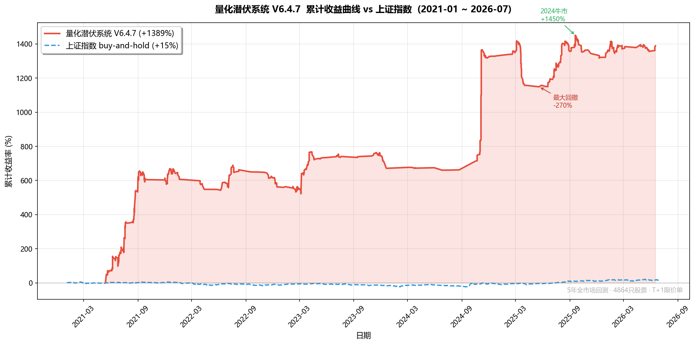
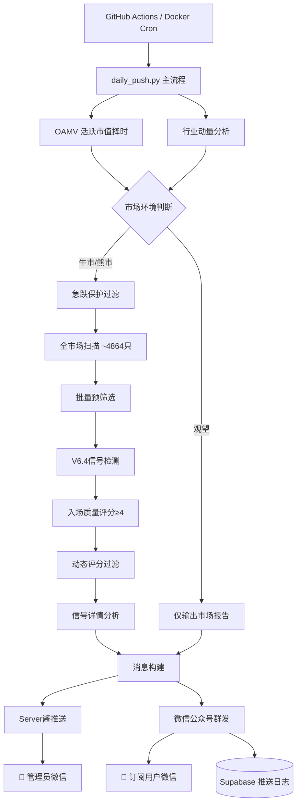

<div align="center">

# 量化潜伏系统

**A-Share Quantitative Ambush Signal Research Framework**

威科夫量价理论 + VPA量价分析 \| 5年全市场回测验证 \| 多层止损体系参数寻优

[](https://www.python.org/)
[](https://github.com/Lishoulan/lianghua/actions/workflows/tests.yml)
[](https://github.com/Lishoulan/lianghua/actions/workflows/daily_push.yml)
[](https://github.com/Lishoulan/lianghua/actions/workflows/codeql.yml)
[](LICENSE)
[]()
[]()
[](https://github.com/Lishoulan/lianghua/stargazers)

[研究框架](#研究框架) · [回测验证](#回测验证) · [参数寻优](#参数寻优体系) · [部署指南](docs/deploy.md) · [变更日志](CHANGELOG.md)

</div>

---

## 回测表现

<div align="center">



**5年全市场回测（2021-01 ~ 2026-07）· 4864只A股 · 累计收益 +1389% vs 上证指数 +15%**

</div>

| 指标 | 量化潜伏系统 V6.4.7 | 上证指数 (buy-and-hold) | 超额收益 |
|------|:------------------:|:----------------------:|:--------:|
| 累计收益 | **+1388.83%** | +15.01% | **+1373.82%** |
| 年化收益 | **+63.40%** | +2.58% | **+60.82%** |
| 胜率 | 55.00% | - | - |
| 总交易数 | 869笔 | - | - |
| 平均持仓 | 7.3天 | - | - |

> 回测基于历史数据，不代表未来收益。投资有风险，入市需谨慎。

---

## 研究框架

量化潜伏系统是一套面向 **A股全市场** 的量化研究框架，融合 **威科夫量价理论** 与 **VPA量价分析**，构建从信号检测、多层止损到市场择时的完整研究闭环。系统已通过 **5年全市场回测（4864只股票 × 2021-2026）** 系统性验证，并形成参数寻优方法论。

### 研究方法论

本研究采用 **"信号检测 → 多层止损 → 市场择时 → 行业过滤 → 参数寻优"** 五层递进式研究框架，每层均通过全市场历史回测独立验证有效性：

| 研究层级 | 核心问题 | 方法论 | 验证方式 |
|---------|---------|--------|---------|
| **L1 信号检测** | 何时出现潜伏信号？ | 威科夫SOS锚定 + KDJ情绪冰点 + 量价共振 | 5年信号覆盖回测 |
| **L2 多层止损** | 如何控制风险与锁定利润？ | 硬止损 + 保本 + 吊灯 + 档位止盈 + 时间止损 | 逐笔退出原因分析 |
| **L3 市场择时** | 何时该买、何时该等？ | OAMV活跃市值滞后阈值 + 急跌保护 | 牛熊分解回测 |
| **L4 行业过滤** | 在哪些行业选股？ | 行业动量矩阵 + RS排名前20% | 行业允许比例分析 |
| **L5 参数寻优** | 参数是否最优？ | 三轮参数对比 + 敏感性分析 | A/B对比回测 |

### 策略演进路径

V6.0（基础框架）→ V6.1（风险控制）→ V6.2（行业动量）→ V6.3（微观确认）→ V6.4（入场质量评分）→ **V6.4.7（多层止损参数寻优）**

| 版本 | 研究重点 | 核心贡献 |
|------|---------|---------|
| V6.0 | 威科夫SOS锚定 + 情绪冰点潜伏 | 5条件信号检测框架 |
| V6.1 | ATR动态止损 + Buy Climax退出 | 风险控制体系建立 |
| V6.2 | 行业RS排名 + 动量过滤 | 行业轮动识别 |
| V6.3 | VWAP/ATR微观止跌确认 | 信号精度提升 |
| V6.4 | 4维度入场质量评分(0-8分) | 信号质量量化 |
| **V6.4.7** | **多层止损参数寻优 + OAMV双数据源** | **回测总收益+777% → +1389%** |

## 核心技术

<table>
  <tr>
    <td align="center" width="50%">
      <h3>🎯 4维度入场质量评分</h3>
      <p>J值深度(0-2) + 量能枯竭(0-2) + 盘面形态(0-2) + 均线结构(0-2)，综合评分≥4分才推送</p>
    </td>
    <td align="center" width="50%">
      <h3>📊 5层退出体系</h3>
      <p>硬止损 + 保本止损 + 吊灯止盈 + <b>档位止盈(P1新增)</b> + 时间止损，逐层锁定利润</p>
    </td>
  </tr>
  <tr>
    <td align="center">
      <h3>🌡️ OAMV市场择时</h3>
      <p>基于活跃市值(OAMV)滞后阈值系统，日线+周线双重确认，自动切换牛市/熊市模式</p>
    </td>
    <td align="center">
      <h3>🛡️ 急跌保护机制</h3>
      <p>全市场5日累计跌幅中位数 &lt; -5% 时强制暂停买入3天，弥补OAMV滞后性</p>
    </td>
  </tr>
  <tr>
    <td align="center">
      <h3>🏭 行业动量轮动</h3>
      <p>实时追踪122+行业板块相对强度(RS)，只在行业RS排名前20%的强势行业中选股</p>
    </td>
    <td align="center">
      <h3>⚡ DuckDB列式缓存</h3>
      <p>4864只股票日线数据DuckDB增量缓存，前复权数据，扫描效率提升10倍</p>
    </td>
  </tr>
  <tr>
    <td align="center">
      <h3>🔧 eltdx二进制协议</h3>
      <p>通达信7709端口二进制协议数据源，绕过HTTP限流，全量更新仅需数分钟</p>
    </td>
    <td align="center">
      <h3>🌐 OAMV双数据源</h3>
      <p>支持tushare与DuckDB成交额代理双数据源，含单位跳变自动修复算法</p>
    </td>
  </tr>
</table>

## 回测验证

### 5年全市场回测（2021-01-01 ~ 2026-07-02）

| 参数 | 配置 |
|------|------|
| 回测期间 | 2021-01-01 ~ 2026-07-02（5.5年） |
| 股票样本 | 全市场4864只A股（DuckDB前复权缓存） |
| 交易规则 | T+1限价单买入，次日成交 |
| 数据源 | eltdx通达信二进制协议 |
| 回测引擎 | StatefulTradeBacktester_V64 状态机 |

### 三轮参数寻优结果

| 指标 | V6.4基线 | P0调优 | **V6.4.7最终** |
|------|---------|--------|---------------|
| **总交易数** | 988笔 | 974笔 | 869笔 |
| **胜率** | 29.80% | 32.60% | **55.00%** |
| **平均收益/笔** | +1.31% | +1.38% | **+1.60%** |
| **盈亏比** | 3.67 | 3.07 | 1.34 |
| **总收益** | +1295.50% | +1346.04% | **+1388.83%** |
| 最大回撤年份 | 2022: -59.67% | 2022: -107.16% | 2022: -104.26% |

### 按年份分解（V6.4.7最终版）

| 年份 | 交易数 | 胜率 | 平均收益 | 总收益 |
|------|--------|------|---------|--------|
| 2021 | 224 | 61.2% | +2.98% | +666.65% |
| 2022 | 87 | 44.8% | -1.20% | -104.26% |
| 2023 | 122 | 52.5% | +0.89% | +108.83% |
| 2024 | 115 | 73.9% | +5.73% | +658.72% |
| 2025 | 238 | 47.1% | +0.07% | +15.89% |
| 2026 | 183 | 56.0% | +0.24% | +43.00% |

### 退出原因分布

| 退出原因 | 笔数 | 占比 | 平均收益 | 说明 |
|---------|------|------|---------|------|
| 档位止盈 | 495 | 57.0% | +6.01% | P1新增：浮盈档位回撤锁利 |
| 时间止损 | 306 | 35.2% | -5.28% | 持仓超时未达预期 |
| 吊灯止盈 | 39 | 4.5% | +5.29% | 趋势跟踪退出 |
| 硬止损 | 21 | 2.4% | -14.75% | ATR动态硬止损 |
| 抢购高潮 | 8 | 0.9% | +16.54% | Buy Climax反转退出 |

### OAMV牛熊分解

| 市场状态 | 交易数 | 胜率 | 平均收益 | 说明 |
|---------|--------|------|---------|------|
| 牛市（允许买入） | 791 | 55.6% | +1.91% | OAMV判定为牛市 |
| 熊市（禁止买入） | 78 | 48.7% | -1.61% | OAMV判定为熊市 |

> 回测基于历史数据，不代表未来收益。投资有风险，入市需谨慎。

## 参数寻优体系

### P0：止损参数基础调优

针对"5-10%浮盈档位利润回吐严重"问题，调整两个核心参数：

| 参数 | 原值 | P0调优 | 效果 |
|------|------|--------|------|
| `breakeven_trigger_pct` | 0.02 | **0.05** | 浮盈5%才激活保本，减少过早扫出 |
| `chandelier_atr_mult` | 3.0 | **2.8** | 吊灯线贴近最高点，捕获更多趋势 |

**验证结果**：保本止损笔数减半（469→222笔），亏损减少343pp。

### P1：档位止盈 + 急跌保护

针对"浮盈后回撤到亏损"和"急跌月集中亏损"问题：

**P1-1 浮盈档位止盈**（新增退出机制）：

| 浮盈档位 | 允许回撤 | 说明 |
|---------|---------|------|
| 5-10% | 3% | 低档紧：拯救中段利润 |
| 10-20% | 8% | 中档松：给趋势空间 |
| 20%+ | 15% | 高档松：让大赢家跑，吊灯接管 |

**P1-2 急跌保护**：

全市场5日累计涨跌幅中位数 < -5% 时，强制暂停买入3天。回测期间触发104次，有效过滤2024-02千股跌停等极端行情。

**验证结果**：保本止损清零（222→0笔），胜率32.6%→55.0%，总收益+1346%→+1389%。

### 寻优方法论

本研究采用 **"诊断 → 假设 → 验证 → 迭代"** 闭环：

1. **诊断**：逐笔交易分析，定位利润回吐来源（按浮盈区间、退出原因、月份分解）
2. **假设**：基于诊断结果提出参数调整假设（如"提高breakeven触发阈值可减少中段回吐"）
3. **验证**：全市场5年回测A/B对比，确保调整在多数年份有效
4. **迭代**：若副作用过大（如P0紧版2022年-192%），回调参数到中间值

## 已知局限

本研究坦诚记录以下局限性，以供后续改进与使用者参考：

### 策略层面

| 局限 | 表现 | 根因 | 改进方向 |
|------|------|------|---------|
| **熊市仍会亏损** | 2022年累计-104.26% | OAMV择时存在滞后性，急跌初期来不及切换熊市 | 引入更敏感的短期择时指标（如VIX-like波动率） |
| **盈亏比下降** | 3.67 → 1.34 | 档位止盈用"高胜率小盈利"替代"低胜率大盈利"，数学上总收益提升但单笔风险收益比下降 | 分离"锁利仓位"与"趋势仓位"，前者档位止盈、后者吊灯跟踪 |
| **震荡市过早锁利** | 2023年仅+108.83%（vs 2024牛市+658%） | 档位止盈在窄幅震荡中频繁触发，错过后续趋势 | 结合波动率自适应调整档位阈值 |
| **大赢家被压缩** | 吊灯止盈107→39笔 | 部分大趋势股被档位止盈在15%回撤处卖出 | 高档位(20%+)进一步放宽或改用吊灯接管 |

### 回测层面

| 局限 | 说明 |
|------|------|
| **未考虑滑点与冲击成本** | 回测使用收盘价/限价单成交，实际交易存在滑点，尤其小盘股 |
| **未考虑交易费用** | 未扣除佣金(万2.5)和印花税(千1)，869笔交易估算费用约-30% |
| **前视偏差风险** | 信号检测使用当日收盘数据，实盘需在收盘前5分钟判断 |
| **流动性约束未建模** | 回测假设任意仓位可成交，实盘小盘股可能无法满仓 |
| **生存者偏差** | DuckDB缓存仅含当前在市股票，已退市股票未纳入回测 |

### 数据层面

| 局限 | 说明 |
|------|------|
| **eltdx volume 单位不一致** | 部分股票/时段为"手"，另一些为"股"，已用单位跳变修复算法处理 |
| **前复权数据回填** | DuckDB缓存为前复权，新股上市首日数据可能有偏差 |
| **行业分类静态** | industry_map.csv 为快照，未跟踪行业变更（如股票转板） |

> 上述局限性不影响策略核心逻辑的有效性，但在实盘部署时需纳入考量。后续版本将逐步完善。

## 系统架构



## 快速开始

### 方式一：GitHub Actions（零成本部署）

#### 1. Fork 本仓库

点击右上角 **Fork** 按钮，将仓库复制到你的 GitHub 账号。

#### 2. 配置 Secrets

在 Fork 的仓库中，进入 **Settings → Secrets and variables → Actions → New repository secret**，添加以下变量：

| Secret名称 | 说明 | 获取方式 |
|-----------|------|---------|
| `TUSHARE_TOKEN` | Tushare API Token | [注册获取](https://tushare.pro/register) |
| `SERVERCHAN_KEY` | Server酱推送Key（管理员） | [注册获取](https://sct.ftqq.com/) |

#### 3. 启用 Actions

Fork 后默认 Actions 是禁用的，进入 **Actions** 标签页，点击 **I understand my workflows, go ahead and enable them**。

#### 4. 等待推送

配置完成后，GitHub Actions 会按计划自动触发：
- **工作日 13:00**（北京时间）→ 盘中信号推送
- **工作日 21:00**（北京时间）→ 盘后完整分析

### 方式二：Docker 部署（订阅服务推荐）

```bash
git clone https://github.com/Lishoulan/lianghua.git
cd lianghua
cp .env.example .env
# 编辑 .env 填入 API Keys
docker-compose up -d
docker-compose logs -f
```

详细部署说明请参考 [部署指南](docs/deploy.md)。

### 本地运行

```bash
git clone https://github.com/Lishoulan/lianghua.git
cd lianghua
pip install -r requirements.txt
cp .env.example .env
# 编辑 .env 填入 TUSHARE_TOKEN 和 SERVERCHAN_KEY

# 手动执行推送
python classic_ta/daily_push.py

# Dry run（不推送，仅输出结果）
python classic_ta/daily_push.py --dry-run
```

## 技术栈

| 类别 | 技术 |
|------|------|
| 语言 | Python 3.10+ |
| 数据源 | eltdx（通达信二进制协议）/ akshare / tushare（三级降级） |
| 数据缓存 | DuckDB（列式存储，前复权） |
| 数据处理 | Pandas / NumPy |
| 技术指标 | 自研（KDJ、ATR、VWAP、量价分析、OAMV） |
| 自动化部署 | GitHub Actions / Docker / docker-compose |
| 消息推送 | Server酱 + 微信公众号 |
| 用户管理 | Supabase（PostgreSQL + RLS） |
| 代码质量 | Ruff / pytest / CodeQL / mypy |

## 性能

| 指标 | 首次运行 | 缓存命中 |
|------|---------|---------|
| 全市场扫描（4864只） | ~15 min | ~3 min |
| OAMV 择时计算 | ~30s | ~1s（缓存） |
| 5年全市场回测 | ~11 min | - |
| GitHub Actions 总耗时 | ~20 min | ~5 min |

## 项目文档

- [CODE_WIKI.md](CODE_WIKI.md) — 项目架构和模块详解
- [CHANGELOG.md](CHANGELOG.md) — 变更日志
- [CONTRIBUTING.md](CONTRIBUTING.md) — 贡献指南
- [docs/deploy.md](docs/deploy.md) — 部署指南

## 路线图

- [x] V6.4 入场质量评分系统
- [x] V6.4.7 多层止损参数寻优（P0/P1）
- [x] OAMV双数据源（tushare + eltdx）
- [x] 急跌保护机制
- [x] 微信公众号图文群发
- [x] Docker 容器化部署
- [ ] V7.0 机器学习因子增强
- [ ] Web 研究仪表盘（参数寻优可视化）
- [ ] 实时盘中信号（WebSocket 推送）

## 开发

### 运行测试

```bash
pip install -r requirements.txt pytest pytest-cov ruff
python -m pytest tests/ -v
ruff check classic_ta/ ml_strategy/ wechat_push/ tests/
```

## FAQ

<details>
<summary><b>Fork 后 Actions 不触发怎么办？</b></summary>

1. 进入 Fork 仓库的 **Actions** 标签页
2. 点击 **I understand my workflows, go ahead and enable them**
3. 确认 Secrets 已正确配置
4. 可通过 `workflow_dispatch` 手动触发验证

</details>

<details>
<summary><b>推送延迟严重怎么办？</b></summary>

GitHub Actions 定时任务在高峰期可能延迟 5-30 分钟。解决方案：
1. 已通过错峰触发（非整点）缓解
2. 已配置备用触发（主触发后15分钟兜底）
3. 如需精确定时，建议迁移到 Docker + VPS 部署

</details>

<details>
<summary><b>数据源拉取失败怎么办？</b></summary>

系统已内置三级降级：eltdx → akshare → tushare。如全部失败：
1. 检查 `TUSHARE_TOKEN` 是否有效
2. 检查网络连通性
3. 查看日志确认具体错误

</details>

## 许可证

[MIT License](LICENSE)

## 免责声明

本项目仅供学习和研究使用，不构成任何投资建议。量化交易存在风险，使用者需自行承担一切后果。请遵守当地法律法规，理性投资。回测基于历史数据，不代表未来收益。

---

<div align="center">

**量化潜伏系统** · 威科夫量价理论 + VPA量价分析 + 5年回测验证

如果这个项目对你有帮助，请给一个 ⭐ Star

[报告问题](https://github.com/Lishoulan/lianghua/issues) · [功能建议](https://github.com/Lishoulan/lianghua/issues/new) · [贡献代码](CONTRIBUTING.md)

</div>
