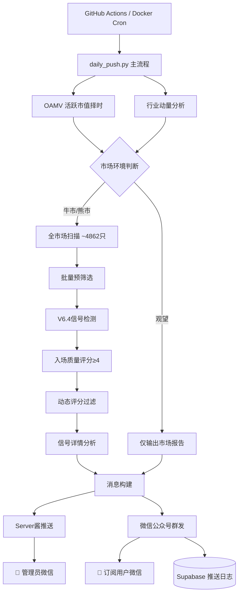
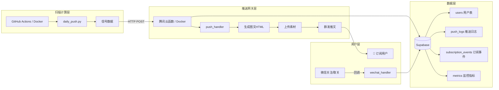

<div align="center">

# 量化潜伏系统

**A-Share Quantitative Ambush Signal Detection System**

基于威科夫量价理论 + VPA量价分析的全市场潜伏信号自动筛选与推送系统

[](https://www.python.org/)
[](https://github.com/Lishoulan/lianghua/actions/workflows/tests.yml)
[](https://github.com/Lishoulan/lianghua/actions/workflows/daily_push.yml)
[](https://github.com/Lishoulan/lianghua/actions/workflows/codeql.yml)
[](LICENSE)
[]()
[](https://github.com/Lishoulan/lianghua/stargazers)

[快速开始](#快速开始) · [订阅服务](#订阅服务架构) · [部署指南](docs/deploy.md) · [变更日志](CHANGELOG.md) · [贡献指南](CONTRIBUTING.md)

</div>

---

## 项目简介

量化潜伏系统是一套面向 **A股全市场** 的自动化量化筛选工具，每日扫描近 5000 只股票，融合 **威科夫量价理论** 与 **VPA量价分析**，通过多维度量化模型识别潜在的潜伏买入信号，并通过 Server酱 + 微信公众号双通道将结果推送到用户。

系统支持 **GitHub Actions 零成本部署** 和 **Docker 容器化长期运行** 两种模式，可作为个人研究工具或微信公众号订阅服务长期运营。

### 核心策略：V6.4 潜伏模型

策略演进：V6.0（基础框架）→ V6.1（风险控制）→ V6.2（行业动量）→ V6.3（微观确认）→ **V6.4（入场质量评分）**

| 版本 | 核心改进 | 关键能力 |
|------|---------|---------|
| V6.0 | 威科夫SOS锚定 + 情绪冰点潜伏 | 5条件信号检测 |
| V6.1 | ATR动态止损 + Buy Climax退出 | 风险控制体系 |
| V6.2 | 行业RS排名 + 动量过滤 | 行业轮动识别 |
| V6.3 | VWAP/ATR微观止跌确认 | 信号精度提升 |
| **V6.4** | **4维度入场质量评分(0-8分)** | **信号质量量化** |

## 核心特性

<table>
  <tr>
    <td align="center" width="50%">
      <h3>🎯 4维度入场质量评分</h3>
      <p>J值深度(0-2) + 量能枯竭(0-2) + 盘面形态(0-2) + 均线结构(0-2)，综合评分≥4分才推送</p>
    </td>
    <td align="center" width="50%">
      <h3>🌡️ OAMV市场择时</h3>
      <p>基于活跃市值(OAMV)滞后阈值系统，日线+周线双重确认，自动切换牛市/熊市模式</p>
    </td>
  </tr>
  <tr>
    <td align="center">
      <h3>🏭 行业动量轮动</h3>
      <p>实时追踪100+行业板块相对强度(RS)，只在行业RS排名前20%的强势行业中选股</p>
    </td>
    <td align="center">
      <h3>⚡ DuckDB列式缓存</h3>
      <p>股票日线数据DuckDB增量缓存，首次全量拉取后仅获取增量，扫描效率提升10倍</p>
    </td>
  </tr>
  <tr>
    <td align="center">
      <h3>📡 多通道推送</h3>
      <p>Server酱(微信) + 微信公众号群发双通道，支持定时投递，确保消息准时到达</p>
    </td>
    <td align="center">
      <h3>🔄 多数据源降级</h3>
      <p>akshare → tushare → mootdx 三级降级机制，保障数据获取稳定性</p>
    </td>
  </tr>
  <tr>
    <td align="center">
      <h3>📊 订阅服务后端</h3>
      <p>Supabase 用户管理 + 订阅墙中间件 + 推送日志 + 运营统计，支持订阅变现</p>
    </td>
    <td align="center">
      <h3>🐳 容器化部署</h3>
      <p>Docker + docker-compose 一键部署，支持 VPS / 腾讯云长期稳定运行</p>
    </td>
  </tr>
</table>

## 系统架构



## 订阅服务架构



**订阅计划**：

| 计划 | 价格 | 信号推送 | 有效期 |
|------|------|---------|--------|
| 免费试用 | ¥0 | ✅ | 7天 |
| 月度订阅 | ¥29/月 | ✅ | 30天 |
| 季度订阅 | ¥79/季 | ✅ | 90天（省8元） |
| 年度订阅 | ¥199/年 | ✅ | 365天（省149元） |

详见 [订阅服务设计文档](docs/specs/2026-06-16-wechat-subscription-design.md) 和 [Supabase Schema](docs/schema.sql)。

## 推送时间

| 时段 | 触发时间(UTC) | 扫描完成(北京) | 到达微信(北京) | 说明 |
|------|-------------|---------------|---------------|------|
| 盘中推送 | 05:30 | ~13:50 | **14:15** | 盘中实时信号 |
| 盘后推送 | 09:30 | ~17:50 | **18:15** | 收盘完整分析 |

> 采用 GitHub Actions 提前触发 + Server酱定时投递双保险机制，确保消息准时到达微信

## 目录结构

```
├── .github/
│   ├── workflows/
│   │   ├── daily_push.yml      # CI/CD: 每日定时推送（错峰+备用+重试+告警）
│   │   ├── tests.yml           # CI: 单元测试（多版本Python）
│   │   ├── codeql.yml          # CI: 代码安全扫描
│   │   └── keepalive.yml       # 防止60天不活动自动禁用
│   ├── dependabot.yml          # 依赖自动更新
│   └── ISSUE_TEMPLATE/         # Issue 模板
├── classic_ta/                 # 核心策略模块
│   ├── daily_push.py           # 统一推送入口
│   ├── v64_ambush_model.py     # V6.4策略模型（入场质量评分）
│   ├── v63_ambush_model.py     # V6.3策略模型（微观确认）
│   ├── v62_ambush_model.py     # V6.2策略模型（行业动量）
│   ├── v61_ambush_model.py     # V6.1策略模型（风险控制）
│   ├── v60_ambush_model.py     # V6.0基础框架
│   ├── stock_data_duckdb.py    # DuckDB数据缓存引擎
│   └── common/                 # 公共模块
│       ├── scanner.py          # 同步/异步扫描器
│       ├── stock_pool.py       # 股票池+预筛选
│       ├── signal_analyzer.py  # 信号详情分析
│       ├── oamv_status.py      # OAMV择时状态
│       ├── industry_analysis.py# 行业分析
│       ├── push_channels.py    # 推送通道(Server酱)
│       └── message_builder.py  # 消息构建
├── ml_strategy/                # 机器学习策略
│   ├── oamv_filter.py          # OAMV滞后阈值择时
│   └── market_amv_cache.py     # 全市场活跃市值缓存
├── wechat_push/                # 微信公众号推送 + 订阅服务
│   ├── __init__.py             # 群发核心
│   ├── cloud_function.py       # 腾讯云函数入口（4个handler）
│   ├── subscription.py         # 订阅墙中间件 + 计划管理
│   └── monitoring.py           # 推送日志 + 监控埋点 + 运营报表
├── tests/                      # 单元测试（70+ tests）
├── docs/
│   ├── deploy.md               # 部署指南
│   ├── schema.sql              # Supabase 数据库 Schema
│   └── specs/                  # 设计文档
├── Dockerfile                  # 容器化构建
├── docker-compose.yml          # 全栈编排
├── pyproject.toml              # 项目元数据 + 工具配置
├── trigger_push.py             # 手动触发推送
├── requirements.txt
└── .env.example                # 环境变量模板
```

## 快速开始

### 方式一：GitHub Actions（零成本）

#### 1. Fork 本仓库

点击右上角 **Fork** 按钮，将仓库复制到你的 GitHub 账号。

#### 2. 配置 Secrets

在 Fork 的仓库中，进入 **Settings → Secrets and variables → Actions → New repository secret**，添加以下变量：

| Secret名称 | 说明 | 获取方式 |
|-----------|------|---------|
| `TUSHARE_TOKEN` | Tushare API Token | [注册获取](https://tushare.pro/register) |
| `SERVERCHAN_KEY` | Server酱推送Key（管理员） | [注册获取](https://sct.ftqq.com/) |
| `SERVERCHAN_KEY_BETA` | Server酱推送Key（内测组） | 同上，第二个Key |

可选（微信公众号订阅服务）：

| Secret名称 | 说明 |
|-----------|------|
| `WECHAT_APP_ID` | 微信公众号AppID |
| `WECHAT_APP_SECRET` | 微信公众号AppSecret |
| `WECHAT_TOKEN` | 微信公众号Token |
| `WECHAT_ENCODING_AES_KEY` | 微信公众号消息加解密Key |
| `SUPABASE_URL` | Supabase项目URL |
| `SUPABASE_KEY` | Supabase服务端Key（service_role） |
| `PUSH_API_KEY` | 推送接口认证Key（自定义） |

#### 3. 启用 Actions

Fork 后默认 Actions 是禁用的，进入 **Actions** 标签页，点击 **I understand my workflows, go ahead and enable them**。

#### 4. 等待推送

配置完成后，GitHub Actions 会按计划自动触发：
- **工作日 13:00**（北京时间）→ 盘中信号推送
- **工作日 21:00**（北京时间）→ 盘后完整分析

### 方式二：Docker 部署（订阅服务推荐）

```bash
# 克隆仓库
git clone https://github.com/Lishoulan/lianghua.git
cd lianghua

# 配置环境变量
cp .env.example .env
# 编辑 .env 填入 API Keys

# 一键启动（扫描服务 + 推送网关）
docker-compose up -d

# 查看日志
docker-compose logs -f
```

详细部署说明请参考 [部署指南](docs/deploy.md)。

### 本地运行

```bash
# 克隆仓库
git clone https://github.com/Lishoulan/lianghua.git
cd lianghua

# 安装依赖
pip install -r requirements.txt

# 配置环境变量
cp .env.example .env
# 编辑 .env 填入 TUSHARE_TOKEN 和 SERVERCHAN_KEY

# 手动执行推送
python classic_ta/daily_push.py

# Dry run（不推送，仅输出结果）
python classic_ta/daily_push.py --dry-run

# 手动触发GitHub Actions
python trigger_push.py
```

## 技术栈

| 类别 | 技术 |
|------|------|
| 语言 | Python 3.10+ |
| 数据源 | akshare / tushare / mootdx（三级降级） |
| 数据缓存 | DuckDB（列式存储） |
| 数据处理 | Pandas / NumPy |
| 技术指标 | 自研（KDJ、ATR、VWAP、量价分析） |
| 自动化部署 | GitHub Actions / Docker / docker-compose |
| 消息推送 | Server酱 + 微信公众号 |
| 用户管理 | Supabase（PostgreSQL + RLS） |
| 推送网关 | 腾讯云函数 / Docker HTTP 服务 |
| 代码质量 | Ruff / pytest / CodeQL / mypy |

## 回测表现

全市场4862只股票 × 5年（2021-2026）回测结果：

| 指标 | 数值 |
|------|------|
| 总交易数 | 173笔 |
| 胜率 | 42.8% |
| 盈亏比 | 2.71 |
| 平均收益 | +4.50% |
| 总收益 | +777.80% |
| 信号日均 | 3.36个 |

> 回测基于历史数据，不代表未来收益。投资有风险，入市需谨慎。

## 性能

| 指标 | 首次运行 | 缓存命中 |
|------|---------|---------|
| 全市场扫描（4862只） | ~15 min | ~3 min |
| OAMV 择时计算 | ~30s | ~1s（缓存） |
| GitHub Actions 总耗时 | ~20 min | ~5 min |

## 开发

### 运行测试

```bash
# 安装开发依赖
pip install -r requirements.txt pytest pytest-cov ruff

# 运行全部测试
python -m pytest tests/ -v

# 带覆盖率
python -m pytest tests/ -v --cov=classic_ta --cov-report=term-missing

# 代码风格检查
ruff check classic_ta/ ml_strategy/ wechat_push/ tests/
```

### 项目文档

- [CODE_WIKI.md](CODE_WIKI.md) — 项目架构和模块详解
- [CHANGELOG.md](CHANGELOG.md) — 变更日志
- [CONTRIBUTING.md](CONTRIBUTING.md) — 贡献指南
- [docs/deploy.md](docs/deploy.md) — 部署指南
- [docs/schema.sql](docs/schema.sql) — 数据库 Schema

## 路线图

- [x] V6.4 入场质量评分系统
- [x] 微信公众号图文群发
- [x] Supabase 用户管理 + 订阅墙
- [x] Docker 容器化部署
- [x] CI/CD 全流程（测试 + 安全扫描 + 告警）
- [ ] V7.0 机器学习因子增强
- [ ] 微信支付集成（订阅自动续费）
- [ ] Web 仪表盘（订阅管理 + 信号回测）
- [ ] 实时盘中信号（WebSocket 推送）

## FAQ

<details>
<summary><b>Fork 后 Actions 不触发怎么办？</b></summary>

1. 进入 Fork 仓库的 **Actions** 标签页
2. 点击 **I understand my workflows, go ahead and enable them**
3. 确认 Secrets 已正确配置
4. 可通过 `workflow_dispatch` 手动触发验证

</details>

<details>
<summary><b>推送延迟严重怎么办？</b></summary>

GitHub Actions 定时任务在高峰期可能延迟 5-30 分钟。解决方案：
1. 已通过错峰触发（非整点）缓解
2. 已配置备用触发（主触发后15分钟兜底）
3. 如需精确定时，建议迁移到 Docker + VPS 部署（见 [部署指南](docs/deploy.md)）

</details>

<details>
<summary><b>数据源拉取失败怎么办？</b></summary>

系统已内置三级降级：akshare → tushare → mootdx。如全部失败：
1. 检查 `TUSHARE_TOKEN` 是否有效
2. 检查网络连通性
3. 查看日志确认具体错误

</details>

<details>
<summary><b>如何从 GitHub Actions 迁移到 Docker？</b></summary>

参考 [部署指南](docs/deploy.md) 的"方式二：Docker + VPS"章节。核心步骤：
1. 准备 VPS（2核2G即可）
2. 安装 Docker
3. 配置 `.env`
4. `docker-compose up -d`

</details>

<details>
<summary><b>订阅服务如何变现？</b></summary>

参考 [订阅服务设计文档](docs/specs/2026-06-16-wechat-subscription-design.md) 的变现路径：
1. 阶段1：群发完整内容，积累用户
2. 阶段2：群发摘要 + 详情页订阅墙
3. 阶段3：升级认证服务号 + 微信支付

</details>

## 许可证

[MIT License](LICENSE)

## 免责声明

本项目仅供学习和研究使用，不构成任何投资建议。量化交易存在风险，使用者需自行承担一切后果。请遵守当地法律法规，理性投资。

---

<div align="center">

**量化潜伏系统** · 威科夫量价理论 + VPA量价分析

如果这个项目对你有帮助，请给一个 ⭐ Star

[报告问题](https://github.com/Lishoulan/lianghua/issues) · [功能建议](https://github.com/Lishoulan/lianghua/issues/new) · [贡献代码](CONTRIBUTING.md)

</div>
