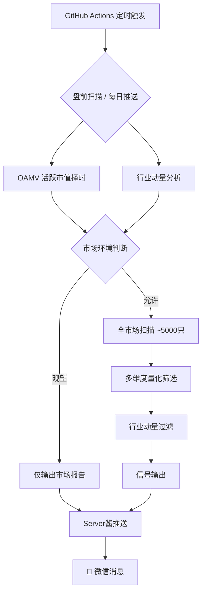

<div align="center">

# 量化潜伏系统

**A-Share Quantitative Latent Signal Detection System**

基于多维度量化模型的全市场潜伏信号自动筛选与推送系统

[](https://www.python.org/)
[](https://github.com/Lishoulan/lianghua/actions)
[](LICENSE)

---

</div>

## 项目简介

量化潜伏系统是一套面向 **A 股全市场** 的自动化量化筛选工具，每日自动扫描近 5000 只股票，通过多维度量化模型识别潜在的买入信号，并将结果通过消息推送直达用户。

系统采用 **GitHub Actions** 实现全自动定时运行，无需人工干预，7×24 小时稳定服务。

## 核心特性

<table>
  <tr>
    <td align="center" width="50%">
      <h3>🎯 多维度信号筛选</h3>
      <p>融合经典技术分析理论与量化指标，从价格形态、量能结构、趋势动量等多个维度综合研判</p>
    </td>
    <td align="center" width="50%">
      <h3>🌡️ 市场环境择时</h3>
      <p>基于活跃市值（OAMV）指标判断市场整体活跃度趋势，自动切换进攻/防守模式</p>
    </td>
  </tr>
  <tr>
    <td align="center">
      <h3>🏭 行业动量过滤</h3>
      <p>实时追踪 100+ 行业板块动量变化，自动识别行业轮动信号，只在强势行业中选股</p>
    </td>
    <td align="center">
      <h3>⚡ 增量缓存加速</h3>
      <p>股票日线数据增量缓存机制，首次全量拉取后后续仅获取增量数据，扫描效率提升 10 倍</p>
    </td>
  </tr>
</table>

## 系统架构



## 技术栈

| 类别 | 技术 |
|------|------|
| 语言 | Python 3.10+ |
| 数据源 | Tushare / AKShare（双源自动降级） |
| 数据处理 | Pandas / NumPy |
| 技术指标 | TA-Lib |
| 自动化部署 | GitHub Actions |
| 消息推送 | Server酱 |
| 缓存优化 | GitHub Actions Cache（actions/cache@v4） |

## 目录结构

```
├── .github/workflows/
│   └── v63_push.yml          # CI/CD: 盘前扫描 + 每日推送
├── classic_ta/
│   ├── v63_daily_push.py     # 每日推送（收盘后）
│   ├── v63_mootdx_push.py    # 盘前扫描推送
│   ├── v63_ambush_model.py   # 量化筛选核心模型
│   ├── v62_ambush_model.py   # 行业动量模块
│   ├── v61_ambush_model.py   # 风险控制模块
│   ├── v60_ambush_model.py   # 基础框架模块
│   └── stock_data_cache.py   # 股票数据增量缓存
├── ml_strategy/
│   ├── oamv_filter.py        # OAMV 活跃市值择时
│   └── market_amv_cache.py   # 全市场 AMV 缓存
├── backtest_ambush_v6.py     # 回测引擎
├── oamv_threshold_optimizer.py # OAMV 参数优化器
├── requirements.txt
└── .env                      # API Keys（不提交）
```

## 自动运行

系统通过 **GitHub Actions** 全自动运行，每日定时触发：

| 任务 | UTC | 北京时间 | 频率 |
|------|-----|---------|------|
| 盘前扫描 | 06:30 | 14:30 | 每天 |
| 每日推送 | 10:30 | 18:30 | 每天 |

支持 `workflow_dispatch` 手动触发。

## 推送效果示例

> 📊 **量化潜伏 · 每日报告**
>
> 🟢 市场环境：活跃度上升，可积极布局
>
> 🏭 强势行业：铜 +5.69% ↑、保险 +3.01% ↑ ...
> 🔄 轮入：铜、摩托车、小金属、保险
> ❄️ 弱势：公共交通、装修装饰、机床制造
>
> 🎯 潜伏信号：XX股份（代码）[行业] 收盘 XX.XX | +X.XX%

*实际推送内容不含策略细节，以结果呈现为主。*

## 本地运行

```bash
# 安装依赖
pip install -r requirements.txt

# 配置环境变量
cp .env.example .env
# 编辑 .env 填入 TUSHARE_TOKEN 和 SERVERCHAN_KEY

# 手动执行每日推送
python classic_ta/v63_daily_push.py

# 手动执行盘前扫描
python classic_ta/v63_mootdx_push.py
```

## 性能

| 指标 | 首次运行 | 缓存命中 |
|------|---------|---------|
| 全市场扫描（~5000只） | ~15 min | ~2 min |
| OAMV 择时计算 | ~30s | ~1s（缓存） |
| GitHub Actions 总耗时 | ~20 min | ~5 min |

## 许可证

[MIT License](LICENSE)

---

<div align="center">

**量化潜伏系统** · 多维度量化筛选

*以上内容为系统量化输出，不构成投资建议*

</div>
